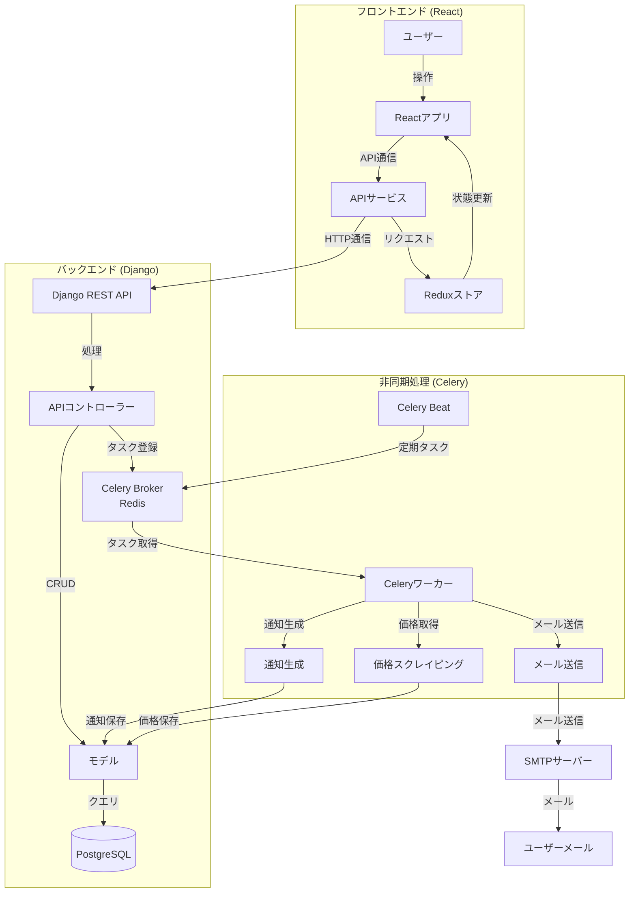
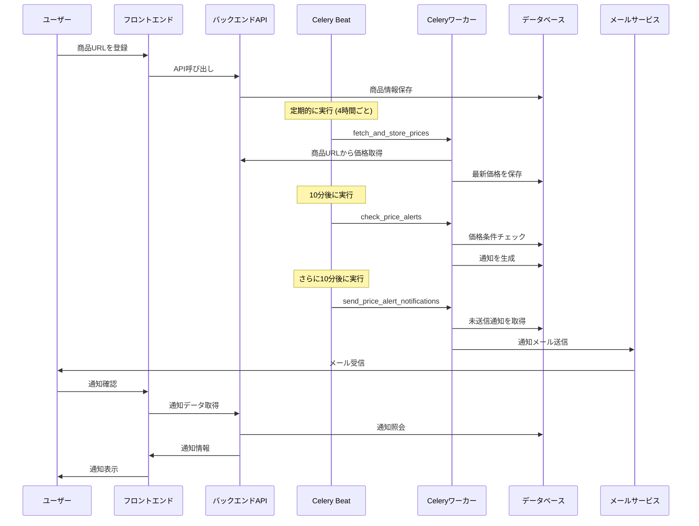

# PriceAlert - 価格追跡システム

PriceAlert は、オンラインショッピングサイトの商品価格を追跡し、設定した条件に基づいて通知を送信するシステムです。ユーザーは商品の URL を登録し、価格が希望する条件（例：20%値下げ）に達した時に通知を受け取ることができます。

## 機能概要

- ユーザー認証（登録・ログイン・パスワードリセット）
- 商品価格の追跡
- 価格アラート設定
- 通知管理
- QR コードスキャン機能
- グラフによる価格履歴表示
- 定期的な価格チェック
- メール通知

## システムアーキテクチャ



## 価格監視と通知の流れ



## 技術スタック

### フロントエンド

- React 18
- TypeScript
- Vite
- Redux Toolkit
- Material UI
- React Router
- React Hook Form
- Axios
- Recharts
- React Toast
- React Spring

### バックエンド

- Python 3.12
- Django 5.0
- Django REST Framework
- PostgreSQL
- Redis
- Celery
- Amazon PA-API 5.0
- BeautifulSoup4
- Selenium
- Gunicorn

## セットアップ方法

### バックエンド

#### 仮想環境のセットアップ

```bash
# 仮想環境の作成と有効化
cd backend
python -m venv .venv

# Windows
.venv\Scripts\activate
# macOS/Linux
source .venv/bin/activate

# 依存関係のインストール
pip install -r requirements.txt
```

#### 環境変数の設定

`.env.example`ファイルを`.env`にコピーして、必要な環境変数を設定します。

```bash
cp .env.example .env
# .envファイルを編集して適切な値を設定してください
```

#### データベースのセットアップ

```bash
# マイグレーションの実行
python manage.py migrate

# 管理者ユーザーの作成
python manage.py createsuperuser

# 定期タスクの初期設定
python manage.py setup_periodic_tasks
```

#### 開発サーバーの起動

```bash
# Django開発サーバーの起動
python manage.py runserver
```

#### Celery の起動

```bash
# Celeryワーカーの起動
celery -A PriceAlert worker --loglevel=info

# Celery Beatの起動（定期タスク用）
celery -A PriceAlert beat -S django --loglevel=info

# Windows環境ではstart_celery.batを使用
# start_celery.bat
```

### フロントエンド

#### 依存関係のインストール

```bash
# npmパッケージのインストール
cd frontend
npm install
```

#### 環境変数の設定

`.env.example`ファイルを`.env`にコピーして、必要な環境変数を設定します。

```bash
cp .env.example .env
# .envファイルを編集して適切な値を設定してください
```

#### 開発サーバーの起動

```bash
# 開発サーバーの起動
npm run dev
```

#### ビルド

```bash
# プロダクションビルド
npm run build

# ビルドのプレビュー
npm run preview
```

## Docker Compose による開発環境

```bash
# 開発環境のコンテナを起動
docker-compose -f docker-compose.dev.yml up -d

# マイグレーションの実行
docker-compose -f docker-compose.dev.yml exec django python manage.py migrate

# 管理者ユーザーの作成
docker-compose -f docker-compose.dev.yml exec django python manage.py createsuperuser

# 定期タスクの初期設定
docker-compose -f docker-compose.dev.yml exec django python manage.py setup_periodic_tasks
```

## テスト

### バックエンド

```bash
# 全テストの実行
cd backend
python manage.py test

# 特定のアプリケーションのテスト実行
python manage.py test accounts

# pytest（推奨）
pytest
pytest -xvs  # 詳細なテスト出力

# カバレッジレポートの生成
coverage run -m pytest
coverage report
coverage html  # HTMLレポートの生成（htmlcov/index.htmlでアクセス）
```

### フロントエンド

```bash
# テストの実行
cd frontend
npm run test

# リンターの実行
npm run lint

# コードフォーマットの実行
npm run format
```

## デプロイ

### Render.com へのバックエンドデプロイ

このプロジェクトは、Render.com のブループリント機能を使用して一括デプロイが可能です。

1. Render.com にログインし、ダッシュボードから「New +」ボタンをクリックします。
2. 「Blueprint」を選択します。
3. GitHub からリポジトリを連携します。
4. `render.yaml`ファイルが自動的に検出され、以下のサービスが一括でデプロイされます：
   - Web サービス（Django）
   - Celery ワーカー
   - Celery Beat スケジューラー
   - Redis インスタンス
   - PostgreSQL データベース

### Vercel へのフロントエンドデプロイ

このプロジェクトは Vercel への自動デプロイが設定されています。main ブランチにプッシュすると自動的にデプロイされます。

#### デプロイ URL

- 本番環境: https://price-alert-delta.vercel.app/

## API エンドポイント

バックエンドサーバーが起動したら、以下の URL から API ドキュメントにアクセスできます：

- API ルート: `http://localhost:8000/api/`
- 管理サイト: `http://localhost:8000/admin/`
- API ドキュメント: `http://localhost:8000/api/schema/swagger-ui/`

## プロジェクト構造

### バックエンド

```
backend/
├── PriceAlert/               # プロジェクト設定
│   ├── __init__.py
│   ├── asgi.py
│   ├── celery.py            # Celery設定
│   ├── settings.py          # Django設定
│   ├── urls.py              # ルートURL設定
│   ├── wsgi.py
│   └── management/
│       └── commands/         # カスタム管理コマンド
│           └── setup_periodic_tasks.py  # 定期タスク設定コマンド
├── accounts/                # ユーザー認証・管理アプリ
├── products/                # 商品管理アプリ
│   └── tasks.py             # 商品関連のCeleryタスク
├── notifications/           # 通知管理アプリ
│   └── tasks.py             # 通知関連のCeleryタスク
├── manage.py                # Djangoコマンドラインツール
├── requirements.txt         # Python依存関係
├── .env                     # 環境変数（gitignoreに含める）
├── .env.example             # 環境変数のサンプル
├── build.sh                 # ビルドスクリプト
├── Dockerfile               # Docker設定
├── docker-compose.dev.yml   # 開発環境用Docker Compose
├── setup.cfg                # 開発ツール設定
└── start_celery.bat         # Windows用Celery起動スクリプト
```

### フロントエンド

```
frontend/
├── public/                # 静的ファイル
├── src/                   # ソースコード
│   ├── assets/            # 画像などのアセット
│   ├── components/        # 共通コンポーネント
│   ├── constants/         # 定数
│   ├── contexts/          # Reactコンテキスト
│   ├── features/          # 機能モジュール
│   ├── hooks/             # カスタムフック
│   ├── pages/             # ページコンポーネント
│   ├── services/          # APIサービス
│   ├── store/             # Reduxストア
│   ├── types/             # TypeScript型定義
│   ├── utils/             # ユーティリティ関数
│   ├── App.tsx            # アプリケーションのルート
│   ├── main.tsx           # エントリーポイント
│   └── index.css          # グローバルCSS
├── .gitignore             # Gitの除外ファイル設定
├── .npmrc                 # npm設定
├── eslint.config.js       # ESLint設定
├── index.html             # HTMLテンプレート
├── package.json           # 依存関係とスクリプト
├── tsconfig.json          # TypeScript設定
├── tsconfig.app.json      # アプリケーション用TS設定
├── tsconfig.node.json     # Node.js用TS設定
├── vercel.json            # Vercelデプロイ設定
└── vite.config.ts         # Vite設定
```

## Celery 定期タスク

本プロジェクトでは、django-celery-beat を使用して定期タスクをデータベースで管理しています。

### 定期実行されるタスク

以下の 3 つのタスクが定期的に実行されます：

1. **fetch_and_store_prices** - 商品価格取得タスク

   - 実行時間: 9 時、13 時、17 時、21 時（4 時間ごと）
   - 役割: 登録されている商品の最新価格を取得して保存

2. **check_price_alerts** - 価格アラートチェックタスク

   - 実行時間: 9:10、13:10、17:10、21:10（fetch_and_store_prices の 10 分後）
   - 役割: 価格条件が満たされた商品に対して通知を生成

3. **send_price_alert_notifications** - 通知送信タスク
   - 実行時間: 9:20、13:20、17:20、21:20（check_price_alerts の 10 分後）
   - 役割: 生成された通知をメールで送信
