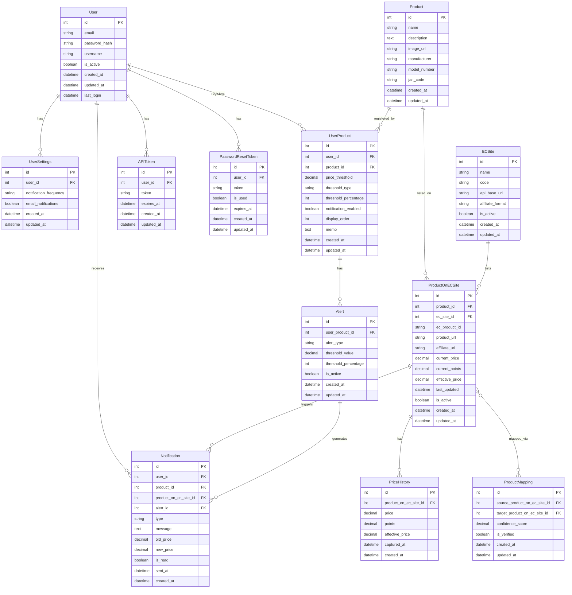

# データモデル詳細設計

## 4. データモデル詳細設計

### 4.1 ER 図



### 4.2 データベーステーブル定義

#### 4.2.1 users（ユーザーテーブル）

| カラム名   | データ型     | NULL 許可 | 初期値            | 説明                           |
| ---------- | ------------ | --------- | ----------------- | ------------------------------ |
| id         | INTEGER      | NO        | AUTO_INCREMENT    | 主キー                         |
| email      | VARCHAR(255) | NO        | -                 | ユーザーメールアドレス（一意） |
| password   | VARCHAR(255) | NO        | -                 | ハッシュ化されたパスワード     |
| username   | VARCHAR(100) | NO        | -                 | ユーザー名                     |
| is_active  | BOOLEAN      | NO        | TRUE              | アカウント有効フラグ           |
| is_staff   | BOOLEAN      | NO        | FALSE             | 管理者フラグ                   |
| created_at | DATETIME     | NO        | CURRENT_TIMESTAMP | 作成日時                       |
| updated_at | DATETIME     | NO        | CURRENT_TIMESTAMP | 更新日時                       |
| last_login | DATETIME     | YES       | NULL              | 最終ログイン日時               |

**インデックス:**

- PRIMARY KEY (id)
- UNIQUE INDEX (email)

#### 4.2.2 user_settings（ユーザー設定テーブル）

| カラム名               | データ型    | NULL 許可 | 初期値            | 説明                               |
| ---------------------- | ----------- | --------- | ----------------- | ---------------------------------- |
| id                     | INTEGER     | NO        | AUTO_INCREMENT    | 主キー                             |
| user_id                | INTEGER     | NO        | -                 | users テーブル外部キー             |
| notification_frequency | VARCHAR(20) | NO        | 'immediately'     | 通知頻度(immediately/daily/weekly) |
| email_notifications    | BOOLEAN     | NO        | TRUE              | メール通知有効フラグ               |
| created_at             | DATETIME    | NO        | CURRENT_TIMESTAMP | 作成日時                           |
| updated_at             | DATETIME    | NO        | CURRENT_TIMESTAMP | 更新日時                           |

**インデックス:**

- PRIMARY KEY (id)
- FOREIGN KEY (user_id) REFERENCES users(id) ON DELETE CASCADE

#### 4.2.3 products（商品テーブル）

| カラム名     | データ型     | NULL 許可 | 初期値            | 説明         |
| ------------ | ------------ | --------- | ----------------- | ------------ |
| id           | INTEGER      | NO        | AUTO_INCREMENT    | 主キー       |
| name         | VARCHAR(255) | NO        | -                 | 商品名       |
| description  | TEXT         | YES       | NULL              | 商品説明     |
| image_url    | VARCHAR(512) | YES       | NULL              | 商品画像 URL |
| manufacturer | VARCHAR(100) | YES       | NULL              | メーカー     |
| model_number | VARCHAR(100) | YES       | NULL              | 型番         |
| jan_code     | VARCHAR(20)  | YES       | NULL              | JAN コード   |
| created_at   | DATETIME     | NO        | CURRENT_TIMESTAMP | 作成日時     |
| updated_at   | DATETIME     | NO        | CURRENT_TIMESTAMP | 更新日時     |

**インデックス:**

- PRIMARY KEY (id)
- INDEX (jan_code)
- INDEX (model_number)

#### 4.2.4 ec_sites（EC サイトテーブル）

| カラム名         | データ型     | NULL 許可 | 初期値            | 説明                       |
| ---------------- | ------------ | --------- | ----------------- | -------------------------- |
| id               | INTEGER      | NO        | AUTO_INCREMENT    | 主キー                     |
| name             | VARCHAR(50)  | NO        | -                 | EC サイト名称              |
| code             | VARCHAR(20)  | NO        | -                 | EC サイトコード            |
| api_base_url     | VARCHAR(255) | YES       | NULL              | API 基本 URL               |
| affiliate_format | VARCHAR(512) | YES       | NULL              | アフィリエイトフォーマット |
| is_active        | BOOLEAN      | NO        | TRUE              | アクティブ状態             |
| created_at       | DATETIME     | NO        | CURRENT_TIMESTAMP | 作成日時                   |
| updated_at       | DATETIME     | NO        | CURRENT_TIMESTAMP | 更新日時                   |

**インデックス:**

- PRIMARY KEY (id)
- UNIQUE INDEX (code)

#### 4.2.5 product_on_ec_sites（商品 EC サイト紐付けテーブル）

| カラム名        | データ型      | NULL 許可 | 初期値            | 説明                      |
| --------------- | ------------- | --------- | ----------------- | ------------------------- |
| id              | INTEGER       | NO        | AUTO_INCREMENT    | 主キー                    |
| product_id      | INTEGER       | NO        | -                 | products テーブル外部キー |
| ec_site_id      | INTEGER       | NO        | -                 | ec_sites テーブル外部キー |
| ec_product_id   | VARCHAR(100)  | NO        | -                 | EC 上の商品 ID            |
| product_url     | VARCHAR(512)  | NO        | -                 | 商品 URL                  |
| affiliate_url   | VARCHAR(1024) | YES       | NULL              | アフィリエイト URL        |
| current_price   | DECIMAL(10,2) | YES       | NULL              | 現在価格                  |
| current_points  | DECIMAL(10,2) | YES       | 0                 | 現在ポイント              |
| effective_price | DECIMAL(10,2) | YES       | NULL              | 実質価格（価格-ポイント） |
| last_updated    | DATETIME      | YES       | NULL              | 価格最終更新日時          |
| is_active       | BOOLEAN       | NO        | TRUE              | アクティブ状態            |
| created_at      | DATETIME      | NO        | CURRENT_TIMESTAMP | 作成日時                  |
| updated_at      | DATETIME      | NO        | CURRENT_TIMESTAMP | 更新日時                  |

**インデックス:**

- PRIMARY KEY (id)
- UNIQUE INDEX (product_id, ec_site_id)
- FOREIGN KEY (product_id) REFERENCES products(id) ON DELETE CASCADE
- FOREIGN KEY (ec_site_id) REFERENCES ec_sites(id) ON DELETE RESTRICT
- INDEX (ec_product_id)

#### 4.2.6 user_products（ユーザー商品紐付けテーブル）

| カラム名             | データ型      | NULL 許可 | 初期値            | 説明                                   |
| -------------------- | ------------- | --------- | ----------------- | -------------------------------------- |
| id                   | INTEGER       | NO        | AUTO_INCREMENT    | 主キー                                 |
| user_id              | INTEGER       | NO        | -                 | users テーブル外部キー                 |
| product_id           | INTEGER       | NO        | -                 | products テーブル外部キー              |
| price_threshold      | DECIMAL(10,2) | YES       | NULL              | 価格閾値                               |
| threshold_type       | VARCHAR(20)   | NO        | 'list_price'      | 閾値タイプ(list_price/effective_price) |
| threshold_percentage | INTEGER       | YES       | NULL              | 閾値割合(%)                            |
| notification_enabled | BOOLEAN       | NO        | TRUE              | 通知有効フラグ                         |
| display_order        | INTEGER       | NO        | 0                 | 表示順                                 |
| memo                 | TEXT          | YES       | NULL              | メモ                                   |
| created_at           | DATETIME      | NO        | CURRENT_TIMESTAMP | 作成日時                               |
| updated_at           | DATETIME      | NO        | CURRENT_TIMESTAMP | 更新日時                               |

**インデックス:**

- PRIMARY KEY (id)
- UNIQUE INDEX (user_id, product_id)
- FOREIGN KEY (user_id) REFERENCES users(id) ON DELETE CASCADE
- FOREIGN KEY (product_id) REFERENCES products(id) ON DELETE CASCADE
- INDEX (threshold_type)

#### 4.2.7 price_histories（価格履歴テーブル）

| カラム名              | データ型      | NULL 許可 | 初期値            | 説明                                 |
| --------------------- | ------------- | --------- | ----------------- | ------------------------------------ |
| id                    | INTEGER       | NO        | AUTO_INCREMENT    | 主キー                               |
| product_on_ec_site_id | INTEGER       | NO        | -                 | product_on_ec_sites テーブル外部キー |
| price                 | DECIMAL(10,2) | NO        | -                 | 価格                                 |
| points                | DECIMAL(10,2) | NO        | 0                 | ポイント                             |
| effective_price       | DECIMAL(10,2) | NO        | -                 | 実質価格                             |
| captured_at           | DATETIME      | NO        | CURRENT_TIMESTAMP | 価格取得日時                         |
| created_at            | DATETIME      | NO        | CURRENT_TIMESTAMP | 作成日時                             |

**インデックス:**

- PRIMARY KEY (id)
- FOREIGN KEY (product_on_ec_site_id) REFERENCES product_on_ec_sites(id) ON DELETE CASCADE
- INDEX (product_on_ec_site_id, captured_at)
- INDEX (captured_at)

#### 4.2.8 alerts（アラート設定テーブル）

| カラム名             | データ型      | NULL 許可 | 初期値            | 説明                           |
| -------------------- | ------------- | --------- | ----------------- | ------------------------------ |
| id                   | INTEGER       | NO        | AUTO_INCREMENT    | 主キー                         |
| user_product_id      | INTEGER       | NO        | -                 | user_products テーブル外部キー |
| alert_type           | VARCHAR(50)   | NO        | 'price_drop'      | アラートタイプ                 |
| threshold_value      | DECIMAL(10,2) | YES       | NULL              | 閾値金額                       |
| threshold_percentage | INTEGER       | YES       | NULL              | 閾値割合(%)                    |
| is_active            | BOOLEAN       | NO        | TRUE              | アラート有効フラグ             |
| created_at           | DATETIME      | NO        | CURRENT_TIMESTAMP | 作成日時                       |
| updated_at           | DATETIME      | NO        | CURRENT_TIMESTAMP | 更新日時                       |

**インデックス:**

- PRIMARY KEY (id)
- FOREIGN KEY (user_product_id) REFERENCES user_products(id) ON DELETE CASCADE
- INDEX (alert_type)

#### 4.2.9 notifications（通知テーブル）

| カラム名              | データ型      | NULL 許可 | 初期値            | 説明                                 |
| --------------------- | ------------- | --------- | ----------------- | ------------------------------------ |
| id                    | INTEGER       | NO        | AUTO_INCREMENT    | 主キー                               |
| user_id               | INTEGER       | NO        | -                 | users テーブル外部キー               |
| product_id            | INTEGER       | NO        | -                 | products テーブル外部キー            |
| product_on_ec_site_id | INTEGER       | NO        | -                 | product_on_ec_sites テーブル外部キー |
| alert_id              | INTEGER       | YES       | NULL              | alerts テーブル外部キー              |
| type                  | VARCHAR(50)   | NO        | -                 | 通知タイプ                           |
| message               | TEXT          | NO        | -                 | 通知メッセージ                       |
| old_price             | DECIMAL(10,2) | YES       | NULL              | 旧価格                               |
| new_price             | DECIMAL(10,2) | YES       | NULL              | 新価格                               |
| is_read               | BOOLEAN       | NO        | FALSE             | 既読フラグ                           |
| sent_at               | DATETIME      | NO        | CURRENT_TIMESTAMP | 送信日時                             |
| created_at            | DATETIME      | NO        | CURRENT_TIMESTAMP | 作成日時                             |

**インデックス:**

- PRIMARY KEY (id)
- FOREIGN KEY (user_id) REFERENCES users(id) ON DELETE CASCADE
- FOREIGN KEY (product_id) REFERENCES products(id) ON DELETE CASCADE
- FOREIGN KEY (product_on_ec_site_id) REFERENCES product_on_ec_sites(id) ON DELETE CASCADE
- FOREIGN KEY (alert_id) REFERENCES alerts(id) ON DELETE SET NULL
- INDEX (user_id, is_read)
- INDEX (sent_at)

#### 4.2.10 api_tokens（API トークンテーブル）

| カラム名   | データ型     | NULL 許可 | 初期値            | 説明                   |
| ---------- | ------------ | --------- | ----------------- | ---------------------- |
| id         | INTEGER      | NO        | AUTO_INCREMENT    | 主キー                 |
| user_id    | INTEGER      | NO        | -                 | users テーブル外部キー |
| token      | VARCHAR(255) | NO        | -                 | トークン文字列         |
| expires_at | DATETIME     | NO        | -                 | 有効期限               |
| created_at | DATETIME     | NO        | CURRENT_TIMESTAMP | 作成日時               |
| updated_at | DATETIME     | NO        | CURRENT_TIMESTAMP | 更新日時               |

**インデックス:**

- PRIMARY KEY (id)
- FOREIGN KEY (user_id) REFERENCES users(id) ON DELETE CASCADE
- UNIQUE INDEX (token)

#### 4.2.11 password_reset_tokens（パスワードリセットトークンテーブル）

| カラム名   | データ型     | NULL 許可 | 初期値            | 説明                   |
| ---------- | ------------ | --------- | ----------------- | ---------------------- |
| id         | INTEGER      | NO        | AUTO_INCREMENT    | 主キー                 |
| user_id    | INTEGER      | NO        | -                 | users テーブル外部キー |
| token      | VARCHAR(255) | NO        | -                 | リセットトークン文字列 |
| is_used    | BOOLEAN      | NO        | FALSE             | 使用済みフラグ         |
| expires_at | DATETIME     | NO        | -                 | 有効期限（24 時間）    |
| created_at | DATETIME     | NO        | CURRENT_TIMESTAMP | 作成日時               |
| updated_at | DATETIME     | NO        | CURRENT_TIMESTAMP | 更新日時               |

**インデックス:**

- PRIMARY KEY (id)
- FOREIGN KEY (user_id) REFERENCES users(id) ON DELETE CASCADE
- UNIQUE INDEX (token)

#### 4.2.12 product_mappings（商品マッピングテーブル）

| カラム名                     | データ型     | NULL 許可 | 初期値            | 説明                                    |
| ---------------------------- | ------------ | --------- | ----------------- | --------------------------------------- |
| id                           | INTEGER      | NO        | AUTO_INCREMENT    | 主キー                                  |
| source_product_on_ec_site_id | INTEGER      | NO        | -                 | 元 product_on_ec_sites テーブル外部キー |
| target_product_on_ec_site_id | INTEGER      | NO        | -                 | 先 product_on_ec_sites テーブル外部キー |
| confidence_score             | DECIMAL(5,4) | NO        | 1.0               | 信頼度スコア(0-1)                       |
| is_verified                  | BOOLEAN      | NO        | FALSE             | 検証済みフラグ                          |
| created_at                   | DATETIME     | NO        | CURRENT_TIMESTAMP | 作成日時                                |
| updated_at                   | DATETIME     | NO        | CURRENT_TIMESTAMP | 更新日時                                |

**インデックス:**

- PRIMARY KEY (id)
- UNIQUE INDEX (source_product_on_ec_site_id, target_product_on_ec_site_id)
- FOREIGN KEY (source_product_on_ec_site_id) REFERENCES product_on_ec_sites(id) ON DELETE CASCADE
- FOREIGN KEY (target_product_on_ec_site_id) REFERENCES product_on_ec_sites(id) ON DELETE CASCADE
- INDEX (confidence_score)

### 4.3 データアクセスパターン

#### 4.3.1 主要クエリパターン

**ユーザーのダッシュボード表示**

```sql
SELECT
    p.id, p.name, p.image_url,
    poes.current_price, poes.effective_price, poes.last_updated,
    es.name as ec_site_name
FROM
    user_products up
JOIN
    products p ON up.product_id = p.id
JOIN
    product_on_ec_sites poes ON p.id = poes.product_id
JOIN
    ec_sites es ON poes.ec_site_id = es.id
WHERE
    up.user_id = ?
ORDER BY
    up.display_order
LIMIT 30;
```

**特定商品の価格履歴取得**

```sql
SELECT
    ph.price, ph.points, ph.effective_price, ph.captured_at
FROM
    price_histories ph
JOIN
    product_on_ec_sites poes ON ph.product_on_ec_site_id = poes.id
WHERE
    poes.product_id = ?
    AND poes.ec_site_id = ?
    AND ph.captured_at >= DATE_SUB(NOW(), INTERVAL 3 MONTH)
ORDER BY
    ph.captured_at;
```

**価格アラート条件に合致する商品検索**

```sql
SELECT
    up.id as user_product_id,
    u.id as user_id, u.email,
    p.id as product_id, p.name,
    poes.current_price, poes.effective_price, poes.affiliate_url,
    es.name as ec_site_name
FROM
    user_products up
JOIN
    users u ON up.user_id = u.id
JOIN
    products p ON up.product_id = p.id
JOIN
    product_on_ec_sites poes ON p.id = poes.product_id
JOIN
    ec_sites es ON poes.ec_site_id = es.id
LEFT JOIN (
    SELECT product_id, MAX(sent_at) as last_sent
    FROM notifications
    GROUP BY product_id
) n ON p.id = n.product_id
WHERE
    up.notification_enabled = TRUE
    AND up.threshold_type = 'list_price'
    AND poes.current_price <= up.price_threshold
    AND (n.last_sent IS NULL OR n.last_sent < DATE_SUB(NOW(), INTERVAL 1 DAY));
```

#### 4.3.2 データ検索・集計パターン

**ユーザー別の登録商品数集計**

```sql
SELECT
    u.id, u.email, COUNT(up.id) as product_count
FROM
    users u
LEFT JOIN
    user_products up ON u.id = up.user_id
GROUP BY
    u.id, u.email;
```

**EC サイト別の最安値商品集計**

```sql
SELECT
    es.name as ec_site_name,
    COUNT(poes.id) as product_count,
    MIN(poes.effective_price) as min_price,
    MAX(poes.effective_price) as max_price,
    AVG(poes.effective_price) as avg_price
FROM
    product_on_ec_sites poes
JOIN
    ec_sites es ON poes.ec_site_id = es.id
WHERE
    poes.current_price > 0
GROUP BY
    es.id, es.name;
```

**過去 30 日間の平均価格変動率**

```sql
SELECT
    p.id, p.name,
    (
        (first_price.price - last_price.price) / first_price.price * 100
    ) as price_change_percentage
FROM
    products p
JOIN (
    SELECT
        poes.product_id, ph.price
    FROM
        price_histories ph
    JOIN
        product_on_ec_sites poes ON ph.product_on_ec_site_id = poes.id
    WHERE
        ph.captured_at = (
            SELECT MIN(ph2.captured_at)
            FROM price_histories ph2
            JOIN product_on_ec_sites poes2 ON ph2.product_on_ec_site_id = poes2.id
            WHERE poes2.product_id = poes.product_id
            AND ph2.captured_at >= DATE_SUB(NOW(), INTERVAL 30 DAY)
        )
) as first_price ON p.id = first_price.product_id
JOIN (
    SELECT
        poes.product_id, ph.price
    FROM
        price_histories ph
    JOIN
        product_on_ec_sites poes ON ph.product_on_ec_site_id = poes.id
    WHERE
        ph.captured_at = (
            SELECT MAX(ph2.captured_at)
            FROM price_histories ph2
            JOIN product_on_ec_sites poes2 ON ph2.product_on_ec_site_id = poes2.id
            WHERE poes2.product_id = poes.product_id
        )
) as last_price ON p.id = last_price.product_id;
```

### 4.4 データマイグレーション計画

#### 4.4.1 初期データベースマイグレーション

Django のマイグレーションシステムを活用し、以下の順序でマイグレーションを実施します：

1. **ベーステーブル作成**

   - users
   - ec_sites
   - products

2. **関連テーブル作成**

   - user_settings
   - product_on_ec_sites

3. **機能テーブル作成**
   - user_products
   - price_histories
   - alerts
   - notifications
   - api_tokens
   - product_mappings

#### 4.4.2 初期データ投入

以下の初期データをシードとして投入します：

1. **EC サイト情報**

   - Amazon
   - 楽天市場
   - Yahoo!ショッピング

2. **テスト用ユーザーアカウント**
   - 管理者アカウント
   - テストユーザーアカウント

#### 4.4.3 データバックアップ戦略

1. **開発環境**

   - 開発環境でのデータバックアップは手動で実施
   - `python manage.py dumpdata` コマンドによる JSON 形式バックアップ

2. **本番環境**
   - 毎日夜間に完全バックアップを実施
   - PostgreSQL の pg_dump を使用した論理バックアップ
   - S3 または Google Cloud Storage への保存
   - 保持期間: 日次バックアップ →2 週間, 週次バックアップ →1 ヶ月, 月次バックアップ →3 ヶ月
