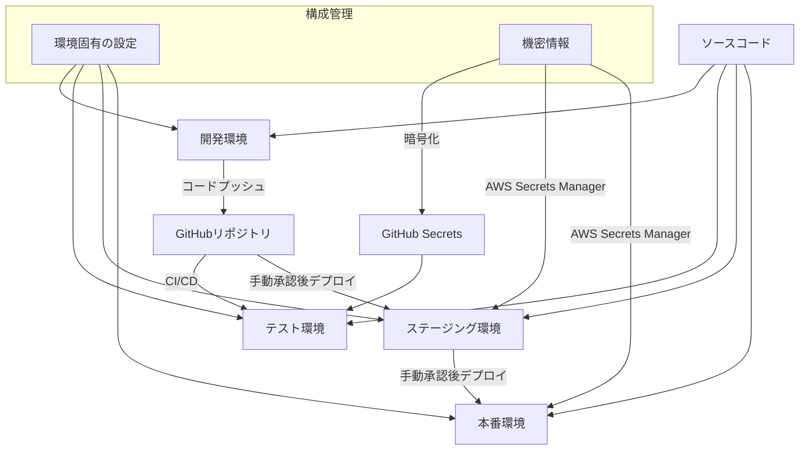
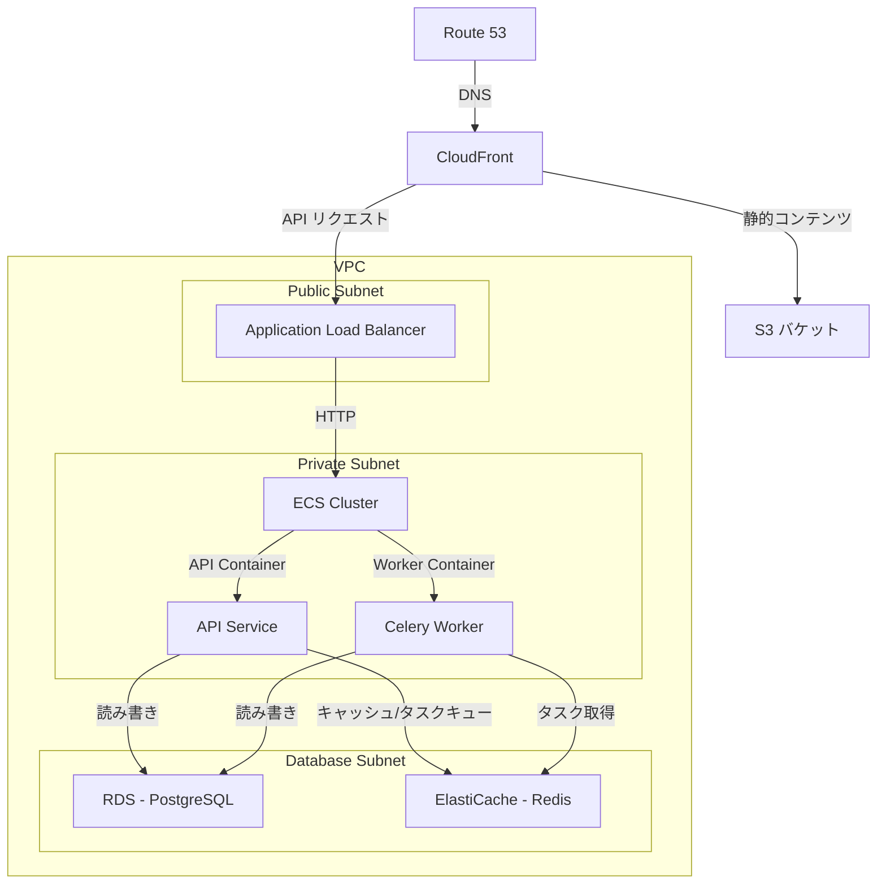
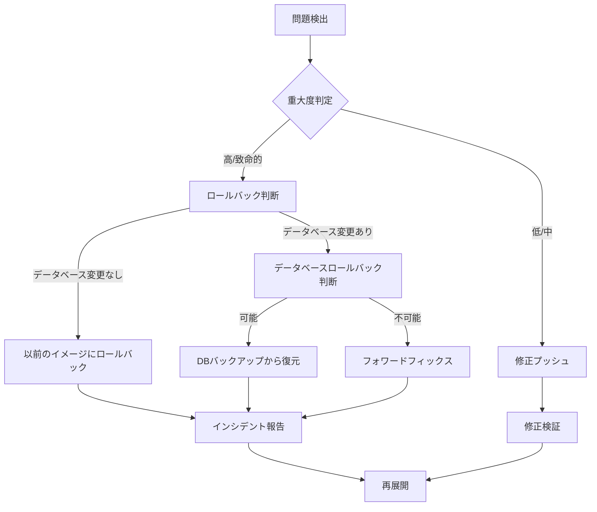

# デプロイメント詳細計画書

## 1. 概要

本書では、PriceAlert システムのデプロイメントに関する詳細設計を記述します。環境構成、コンテナ化戦略、CI/CD 実装、データベース移行計画などについて説明します。

## 2. 環境構成

### 2.1 環境一覧

| 環境名           | 目的                 | アクセス範囲       | インフラ                  |
| ---------------- | -------------------- | ------------------ | ------------------------- |
| 開発環境         | 開発者の実装・テスト | 開発チーム内       | Docker Compose (ローカル) |
| テスト環境       | 自動テスト実行       | CI/CD              | GitHub Actions            |
| ステージング環境 | リリース前検証       | 開発・テストチーム | AWS                       |
| 本番環境         | 実サービス提供       | 一般ユーザー       | AWS                       |

### 2.2 環境分離戦略



## 3. コンテナ化戦略

### 3.1 Docker イメージ構成

```
price-alert/
├── Dockerfile.api        # APIサーバー用Dockerfile
├── Dockerfile.worker     # Celeryワーカー用Dockerfile
├── Dockerfile.frontend   # フロントエンド用Dockerfile
├── docker-compose.yml    # 開発環境構成
└── docker-compose.prod.yml # 本番環境構成
```

### 3.2 API サーバー Dockerfile

```dockerfile
# Dockerfile.api
FROM python:3.12-slim as builder

WORKDIR /app

# 依存関係インストール用ファイルコピー
COPY requirements.txt ./
COPY requirements-prod.txt ./

# 依存関係インストール
RUN pip install --no-cache-dir -r requirements-prod.txt

# マルチステージビルドで最終イメージ作成
FROM python:3.12-slim

WORKDIR /app

# セキュリティ対策：rootユーザー以外で実行
RUN groupadd -r appuser && useradd -r -g appuser appuser

# 必要なランタイム依存関係のみインストール
RUN apt-get update && apt-get install -y --no-install-recommends \
    postgresql-client \
    && rm -rf /var/lib/apt/lists/*

# builderからのファイルコピー
COPY --from=builder /usr/local/lib/python3.12/site-packages /usr/local/lib/python3.12/site-packages
COPY --from=builder /usr/local/bin /usr/local/bin

# アプリケーションコードコピー
COPY . .

# 所有権設定
RUN chown -R appuser:appuser /app

# 非rootユーザーに切り替え
USER appuser

# アプリケーション起動
CMD ["gunicorn", "PriceAlert.PriceAlert.wsgi:application", "--bind", "0.0.0.0:8000", "--workers", "3"]
```

### 3.3 フロントエンド Dockerfile

```dockerfile
# Dockerfile.frontend
FROM node:18-alpine as builder

WORKDIR /app

# 依存関係ファイルコピー
COPY frontend/package.json frontend/package-lock.json ./

# 依存関係インストール
RUN npm ci

# ソースコードコピー
COPY frontend/ ./

# 本番用ビルド
RUN npm run build

# Nginxベースの配信用イメージ
FROM nginx:alpine

# ビルド成果物をNginxの配信ディレクトリにコピー
COPY --from=builder /app/build /usr/share/nginx/html

# Nginx設定
COPY nginx/default.conf /etc/nginx/conf.d/default.conf

# ヘルスチェック用ファイル
RUN echo "OK" > /usr/share/nginx/html/health.txt

EXPOSE 80

CMD ["nginx", "-g", "daemon off;"]
```

### 3.4 Docker Compose 設定

```yaml
# docker-compose.yml (開発環境用)
version: "3.8"

services:
  db:
    image: postgres:14-alpine
    volumes:
      - postgres_data:/var/lib/postgresql/data
    environment:
      - POSTGRES_USER=postgres
      - POSTGRES_PASSWORD=postgres
      - POSTGRES_DB=price_alert
    ports:
      - "5432:5432"

  redis:
    image: redis:alpine
    ports:
      - "6379:6379"

  api:
    build:
      context: .
      dockerfile: Dockerfile.api
    command: python manage.py runserver 0.0.0.0:8000
    volumes:
      - .:/app
    ports:
      - "8000:8000"
    environment:
      - DEBUG=1
      - DATABASE_URL=postgresql://postgres:postgres@db:5432/price_alert
      - REDIS_URL=redis://redis:6379/0
    depends_on:
      - db
      - redis

  worker:
    build:
      context: .
      dockerfile: Dockerfile.worker
    command: celery -A price_alert worker -l info
    volumes:
      - .:/app
    environment:
      - DEBUG=1
      - DATABASE_URL=postgresql://postgres:postgres@db:5432/price_alert
      - REDIS_URL=redis://redis:6379/0
    depends_on:
      - db
      - redis

  frontend:
    build:
      context: .
      dockerfile: Dockerfile.frontend
    command: npm start
    volumes:
      - ./frontend:/app
      - /app/node_modules
    ports:
      - "3000:3000"
    environment:
      - REACT_APP_API_URL=http://localhost:8000/api
    depends_on:
      - api

volumes:
  postgres_data:
```

## 4. CI/CD 実装

### 4.1 GitHub Actions ワークフロー

```yaml
# .github/workflows/deploy.yml
name: Deploy

on:
  push:
    branches: [main, develop]
  pull_request:
    branches: [main]

jobs:
  test:
    runs-on: ubuntu-latest
    steps:
      - uses: actions/checkout@v2

      # バックエンドテスト
      - name: Set up Python
        uses: actions/setup-python@v2
        with:
          python-version: "3.12"

      - name: Install dependencies
        run: |
          python -m pip install --upgrade pip
          pip install -r requirements.txt
          pip install -r requirements-dev.txt

      - name: Run tests
        run: pytest

      # フロントエンドテスト
      - name: Set up Node.js
        uses: actions/setup-node@v2
        with:
          node-version: "18"

      - name: Install frontend dependencies
        run: |
          cd frontend
          npm ci

      - name: Run frontend tests
        run: |
          cd frontend
          npm test -- --coverage

  build:
    needs: test
    runs-on: ubuntu-latest
    steps:
      - uses: actions/checkout@v2

      # Docker イメージビルド
      - name: Set up Docker Buildx
        uses: docker/setup-buildx-action@v1

      - name: Login to GitHub Container Registry
        uses: docker/login-action@v1
        with:
          registry: ghcr.io
          username: ${{ github.actor }}
          password: ${{ secrets.GITHUB_TOKEN }}

      - name: Build and push API image
        uses: docker/build-push-action@v2
        with:
          context: .
          file: ./Dockerfile.api
          push: true
          tags: ghcr.io/${{ github.repository }}/api:${{ github.sha }}

      - name: Build and push Worker image
        uses: docker/build-push-action@v2
        with:
          context: .
          file: ./Dockerfile.worker
          push: true
          tags: ghcr.io/${{ github.repository }}/worker:${{ github.sha }}

      - name: Build and push Frontend image
        uses: docker/build-push-action@v2
        with:
          context: .
          file: ./Dockerfile.frontend
          push: true
          tags: ghcr.io/${{ github.repository }}/frontend:${{ github.sha }}

  deploy-staging:
    needs: build
    if: github.ref == 'refs/heads/develop'
    runs-on: ubuntu-latest
    environment: staging
    steps:
      - uses: actions/checkout@v2

      # AWSへのデプロイ
      - name: Configure AWS credentials
        uses: aws-actions/configure-aws-credentials@v1
        with:
          aws-access-key-id: ${{ secrets.AWS_ACCESS_KEY_ID }}
          aws-secret-access-key: ${{ secrets.AWS_SECRET_ACCESS_KEY }}
          aws-region: ap-northeast-1

      - name: Update ECS services
        run: |
          aws ecs update-service --cluster price-alert-staging --service api --force-new-deployment
          aws ecs update-service --cluster price-alert-staging --service worker --force-new-deployment
          aws ecs update-service --cluster price-alert-staging --service frontend --force-new-deployment

  deploy-production:
    needs: build
    if: github.ref == 'refs/heads/main'
    runs-on: ubuntu-latest
    environment: production
    steps:
      - uses: actions/checkout@v2

      # プロダクション環境へのデプロイ（承認後）
      - name: Configure AWS credentials
        uses: aws-actions/configure-aws-credentials@v1
        with:
          aws-access-key-id: ${{ secrets.AWS_ACCESS_KEY_ID }}
          aws-secret-access-key: ${{ secrets.AWS_SECRET_ACCESS_KEY }}
          aws-region: ap-northeast-1

      - name: Update ECS services
        run: |
          aws ecs update-service --cluster price-alert-production --service api --force-new-deployment
          aws ecs update-service --cluster price-alert-production --service worker --force-new-deployment
          aws ecs update-service --cluster price-alert-production --service frontend --force-new-deployment
```

## 5. AWS インフラストラクチャ

### 5.1 AWS 構成図



### 5.2 ECS タスク定義

```json
{
  "family": "price-alert-api",
  "executionRoleArn": "arn:aws:iam::123456789012:role/ecsTaskExecutionRole",
  "taskRoleArn": "arn:aws:iam::123456789012:role/price-alert-task-role",
  "networkMode": "awsvpc",
  "containerDefinitions": [
    {
      "name": "api",
      "image": "ghcr.io/myorg/price-alert/api:latest",
      "essential": true,
      "portMappings": [
        {
          "containerPort": 8000,
          "hostPort": 8000,
          "protocol": "tcp"
        }
      ],
      "environment": [
        {
          "name": "DEBUG",
          "value": "0"
        }
      ],
      "secrets": [
        {
          "name": "DATABASE_URL",
          "valueFrom": "arn:aws:secretsmanager:ap-northeast-1:123456789012:secret:production/price-alert/database-url-aBcDeF"
        },
        {
          "name": "REDIS_URL",
          "valueFrom": "arn:aws:secretsmanager:ap-northeast-1:123456789012:secret:production/price-alert/redis-url-GhIjKl"
        },
        {
          "name": "SECRET_KEY",
          "valueFrom": "arn:aws:secretsmanager:ap-northeast-1:123456789012:secret:production/price-alert/secret-key-MnOpQr"
        }
      ],
      "logConfiguration": {
        "logDriver": "awslogs",
        "options": {
          "awslogs-group": "/ecs/price-alert-api",
          "awslogs-region": "ap-northeast-1",
          "awslogs-stream-prefix": "ecs"
        }
      },
      "healthCheck": {
        "command": [
          "CMD-SHELL",
          "curl -f http://localhost:8000/health/ || exit 1"
        ],
        "interval": 30,
        "timeout": 5,
        "retries": 3,
        "startPeriod": 60
      }
    }
  ],
  "requiresCompatibilities": ["FARGATE"],
  "cpu": "1024",
  "memory": "2048"
}
```

## 6. データベース移行計画

### 6.1 マイグレーション戦略

Django ORM ベースのマイグレーション戦略を以下に示します：

1. **Django Migration の活用**

   - Django モデルの変更を追跡
   - バージョン管理されたマイグレーションファイル生成

2. **マイグレーション手順**

   - 開発環境でのモデル変更
   - `python manage.py makemigrations` によるマイグレーションファイル自動生成
   - マイグレーションファイルの手動レビュー
   - リポジトリへのコミット

3. **デプロイメント時のマイグレーション実行**
   - CI/CD パイプラインでのマイグレーション自動適用
   - ダウンタイムなしマイグレーション（可能な場合）
   - ロールバック計画

### 6.2 マイグレーション設定

```python
# settings.py 内のデータベース設定
DATABASES = {
    'default': {
        'ENGINE': 'django.db.backends.postgresql',
        'NAME': os.environ.get('DB_NAME', 'price_alert'),
        'USER': os.environ.get('DB_USER', 'postgres'),
        'PASSWORD': os.environ.get('DB_PASSWORD', ''),
        'HOST': os.environ.get('DB_HOST', 'localhost'),
        'PORT': os.environ.get('DB_PORT', '5432'),
    }
}

# マイグレーション設定
MIGRATION_MODULES = {
    'users': 'users.migrations',
    'products': 'products.migrations',
    'price_tracking': 'price_tracking.migrations',
    'alerts': 'alerts.migrations',
    'ec_sites': 'ec_sites.migrations',
}
```

### 6.3 マイグレーション実行スクリプト

```bash
#!/bin/bash
# 本番環境でのマイグレーション実行スクリプト

set -e

# 環境確認
if [ -z "$DJANGO_SETTINGS_MODULE" ]; then
    echo "ERROR: DJANGO_SETTINGS_MODULE environment variable is not set"
    exit 1
fi

# バックアップ作成
echo "Creating database backup..."
python manage.py dbbackup

# マイグレーション実行
echo "Running database migrations..."
python manage.py migrate

# マイグレーション結果の確認
echo "Checking migration status..."
python manage.py showmigrations --list

echo "Migration completed successfully!"
```

## 7. ステージング環境から本番環境への移行計画

### 7.1 リリースフロー

1. **テスト環境での検証**

   - 自動テストの全パス確認
   - 手動テストでのユーザーストーリー確認

2. **ステージング環境へのデプロイ**

   - develop ブランチからステージング環境へ自動デプロイ
   - データベースマイグレーション実行
   - ステージング環境での検証

3. **本番環境へのデプロイ**
   - ステージングからのプロモーション (GitHub リリース作成)
   - 承認プロセス (GitHub Environments 承認ワークフロー)
   - 限定ユーザーへのロールアウト (初期段階)
   - 全ユーザーへの段階的ロールアウト

### 7.2 本番デプロイチェックリスト

- [ ] すべての自動テストがパスしている
- [ ] セキュリティスキャンが完了している
- [ ] パフォーマンステストが完了している
- [ ] データベースバックアップが最新である
- [ ] ロールバック計画が準備されている
- [ ] 監視システムが正常に動作している
- [ ] オンコール担当者が割り当てられている
- [ ] リリースノートが準備されている

### 7.3 ロールバック計画



## 8. 継続的改善計画

### 8.1 デプロイメント指標

以下の指標を継続的に測定し、デプロイメントプロセスを改善します：

- **デプロイ頻度**: 週あたりのデプロイ回数
- **変更リードタイム**: コミットから本番稼働までの時間
- **デプロイ失敗率**: 失敗したデプロイの割合
- **平均復旧時間**: 障害からの復旧にかかる平均時間
- **ロールバック率**: ロールバックが必要なデプロイの割合

### 8.2 自動化目標

今後 6 ヶ月で以下の自動化を実装する計画です：

1. **自動カナリアデプロイ**: 一部のユーザーに新バージョンを提供し、自動指標監視
2. **自動スケーリング**: 負荷に応じた ECS サービスの自動スケーリング設定
3. **ブルー/グリーンデプロイ**: ダウンタイムゼロデプロイメントの実現
4. **自動データベース最適化**: パフォーマンス指標に基づく自動インデックス提案
5. **インフラストラクチャのコード化**: AWS CDK を使用したインフラ管理
