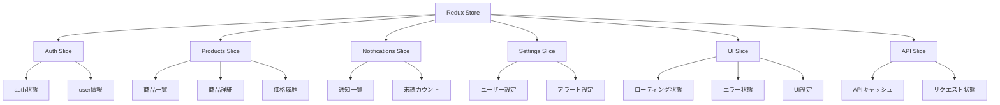
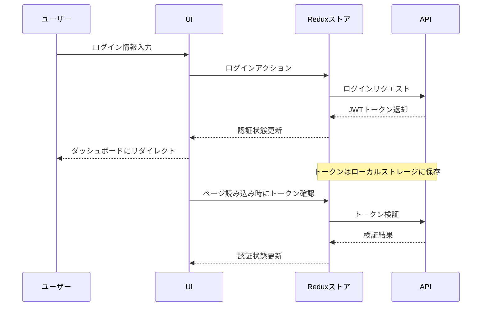
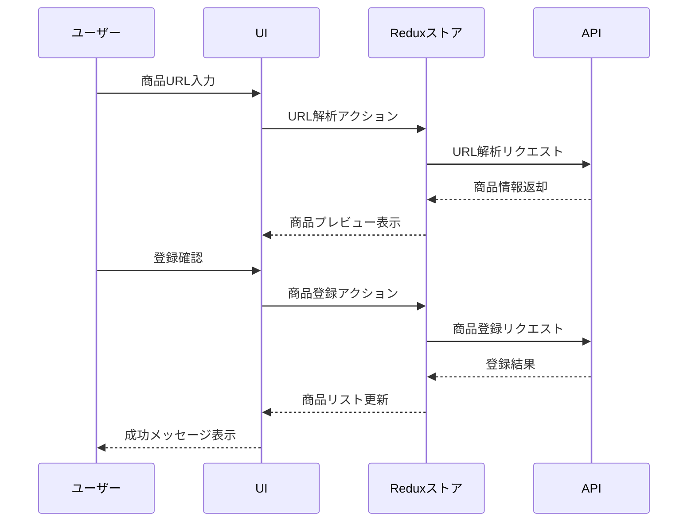
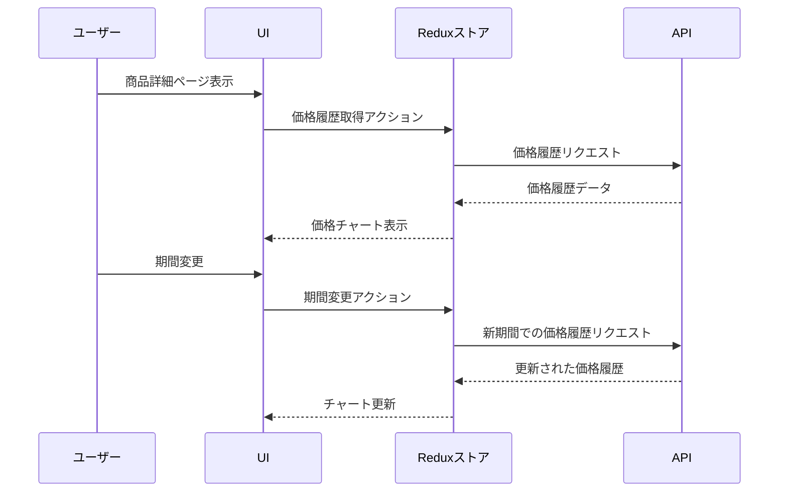

# フロントエンド詳細設計

## 6. フロントエンド詳細設計

### 6.1 フロントエンド概要

PriceAlert のフロントエンドは、React.js を使用した Single Page Application（SPA）として実装します。ユーザーフレンドリーなインターフェイスを提供し、商品の価格追跡・比較・通知設定などの機能を直感的に操作できるよう設計します。

### 6.2 技術スタック詳細

#### 6.2.1 コア技術

- **ReactJS**: UI 構築の中核フレームワーク（v18.x）
- **TypeScript**: 型安全な開発のための言語
- **React Router**: ページナビゲーション管理
- **Redux Toolkit**: 状態管理
- **RTK Query**: API リクエスト管理とキャッシュ

#### 6.2.2 UI/UX ライブラリ

- **Material UI (MUI)**: コア UI コンポーネント
- **Recharts**: データ可視化/グラフ表示
- **React Hook Form**: フォーム管理
- **Yup**: バリデーション
- **React Toastify**: トースト通知
- **Material Icons**: アイコン

#### 6.2.3 開発ツール

- **Vite**: 開発環境・ビルドツール
- **ESLint**: コード品質管理
- **Prettier**: コードフォーマット
- **Jest/React Testing Library**: ユニットテスト
- **Cypress**: E2E テスト

### 6.3 アプリケーション構造

#### 6.3.1 ディレクトリ構造

```
frontend/
├── public/                 # 静的ファイル
│   ├── favicon.ico
│   ├── robots.txt
│   └── ...
├── src/
│   ├── assets/             # 画像、フォント等
│   ├── components/         # 再利用可能なUIコンポーネント
│   │   ├── common/         # 汎用コンポーネント
│   │   ├── layout/         # レイアウト関連コンポーネント
│   │   ├── products/       # 商品関連コンポーネント
│   │   └── ...
│   ├── features/           # 機能モジュール
│   │   ├── auth/           # 認証関連
│   │   ├── products/       # 商品関連
│   │   ├── notifications/  # 通知関連
│   │   └── ...
│   ├── hooks/              # カスタムフック
│   ├── pages/              # ページコンポーネント
│   ├── services/           # APIサービス
│   ├── store/              # Reduxストア
│   ├── types/              # TypeScript型定義
│   ├── utils/              # ユーティリティ関数
│   ├── App.tsx             # アプリケーションのルートコンポーネント
│   ├── main.tsx            # エントリーポイント
│   └── ...
├── package.json
├── tsconfig.json
├── vite.config.ts
└── ...
```

#### 6.3.2 機能モジュール構成

各機能モジュール（features/以下）は以下の構造を持ちます：

```
features/products/
├── components/        # モジュール専用コンポーネント
├── hooks/             # モジュール専用フック
├── services/          # APIリクエスト定義
├── slices/            # Reduxスライス
├── types/             # 型定義
└── utils/             # ユーティリティ関数
```

### 6.4 状態管理設計

#### 6.4.1 Redux ストア構成



#### 6.4.2 主要ステート一覧

| スライス名    | ステート名      | 説明                 | 用途                         |
| ------------- | --------------- | -------------------- | ---------------------------- |
| auth          | user            | ログインユーザー情報 | ユーザー表示、認証状態確認   |
| auth          | token           | JWT 認証トークン     | API 認証                     |
| auth          | isAuthenticated | 認証状態             | 保護ルートの制御             |
| products      | productList     | 登録商品一覧         | ダッシュボード表示           |
| products      | selectedProduct | 選択中の商品         | 商品詳細表示                 |
| products      | priceHistory    | 価格履歴データ       | グラフ表示                   |
| notifications | notifications   | 通知一覧             | 通知表示                     |
| notifications | unreadCount     | 未読通知数           | バッジ表示                   |
| settings      | userSettings    | ユーザー設定         | 設定画面表示                 |
| ui            | isLoading       | ローディング状態     | ローディングインジケータ制御 |
| ui            | error           | エラー情報           | エラー表示                   |
| ui            | theme           | テーマ設定           | ダーク/ライトモード切替      |

#### 6.4.3 Redux Toolkit スライス実装例

```javascript
// features/products/slices/productsSlice.ts
import { createSlice, PayloadAction } from "@reduxjs/toolkit";
import { ProductState, Product, PriceHistory } from "../types";

const initialState: ProductState = {
  productList: [],
  selectedProduct: null,
  priceHistory: [],
  loading: false,
  error: null,
};

const productsSlice = createSlice({
  name: "products",
  initialState,
  reducers: {
    setProductList: (state, action: PayloadAction<Product[]>) => {
      state.productList = action.payload;
      state.error = null;
    },
    setSelectedProduct: (state, action: PayloadAction<Product | null>) => {
      state.selectedProduct = action.payload;
    },
    setPriceHistory: (state, action: PayloadAction<PriceHistory[]>) => {
      state.priceHistory = action.payload;
    },
    setLoading: (state, action: PayloadAction<boolean>) => {
      state.loading = action.payload;
    },
    setError: (state, action: PayloadAction<string | null>) => {
      state.error = action.payload;
    },
  },
});

export const {
  setProductList,
  setSelectedProduct,
  setPriceHistory,
  setLoading,
  setError,
} = productsSlice.actions;

export default productsSlice.reducer;
```

#### 6.4.4 RTK Query 実装例

```javascript
// services/api.ts
import { createApi, fetchBaseQuery } from '@reduxjs/toolkit/query/react';
import { RootState } from '../store';

export const api = createApi({
  reducerPath: 'api',
  baseQuery: fetchBaseQuery({
    baseUrl: '/api/',
    prepareHeaders: (headers, { getState }) => {
      const token = (getState() as RootState).auth.token;
      if (token) {
        headers.set('authorization', `Bearer ${token}`);
      }
      return headers;
    },
  }),
  endpoints: (builder) => ({
    getProducts: builder.query({
      query: () => 'products/',
    }),
    getProductById: builder.query({
      query: (id) => `products/${id}/`,
    }),
    getPriceHistory: builder.query({
      query: ({ id, ecSiteId, period, priceType }) => ({
        url: `products/${id}/price-history/`,
        params: { ec_site_id: ecSiteId, period, price_type: priceType },
      }),
    }),
    registerProduct: builder.mutation({
      query: (url) => ({
        url: 'products/',
        method: 'POST',
        body: { url },
      }),
    }),
  }),
});

export const {
  useGetProductsQuery,
  useGetProductByIdQuery,
  useGetPriceHistoryQuery,
  useRegisterProductMutation,
} = api;
```

### 6.5 ルーティング設計

#### 6.5.1 ルート構成

| パス             | コンポーネント    | 認証要否 | 説明               |
| ---------------- | ----------------- | -------- | ------------------ |
| `/`              | LandingPage       | 不要     | ランディングページ |
| `/login`         | LoginPage         | 不要     | ログインページ     |
| `/register`      | RegisterPage      | 不要     | 会員登録ページ     |
| `/dashboard`     | DashboardPage     | 必要     | ダッシュボード     |
| `/products/add`  | AddProductPage    | 必要     | 商品登録ページ     |
| `/products/:id`  | ProductDetailPage | 必要     | 商品詳細ページ     |
| `/settings`      | SettingsPage      | 必要     | 設定ページ         |
| `/notifications` | NotificationsPage | 必要     | 通知一覧ページ     |
| `/profile`       | ProfilePage       | 必要     | プロフィールページ |
| `*`              | NotFoundPage      | 不要     | 404 ページ         |

#### 6.5.2 ルーティング実装

```javascript
// App.tsx
import { BrowserRouter, Routes, Route } from "react-router-dom";
import ProtectedRoute from "./components/common/ProtectedRoute";
import Layout from "./components/layout/Layout";

// Pages
import LandingPage from "./pages/LandingPage";
import LoginPage from "./pages/LoginPage";
import RegisterPage from "./pages/RegisterPage";
import DashboardPage from "./pages/DashboardPage";
import AddProductPage from "./pages/AddProductPage";
import ProductDetailPage from "./pages/ProductDetailPage";
import SettingsPage from "./pages/SettingsPage";
import NotificationsPage from "./pages/NotificationsPage";
import ProfilePage from "./pages/ProfilePage";
import NotFoundPage from "./pages/NotFoundPage";

const App = () => {
  return (
    <BrowserRouter>
      <Routes>
        <Route path="/" element={<LandingPage />} />
        <Route path="/login" element={<LoginPage />} />
        <Route path="/register" element={<RegisterPage />} />

        <Route element={<Layout />}>
          <Route
            path="/dashboard"
            element={
              <ProtectedRoute>
                <DashboardPage />
              </ProtectedRoute>
            }
          />
          <Route
            path="/products/add"
            element={
              <ProtectedRoute>
                <AddProductPage />
              </ProtectedRoute>
            }
          />
          <Route
            path="/products/:id"
            element={
              <ProtectedRoute>
                <ProductDetailPage />
              </ProtectedRoute>
            }
          />
          <Route
            path="/settings"
            element={
              <ProtectedRoute>
                <SettingsPage />
              </ProtectedRoute>
            }
          />
          <Route
            path="/notifications"
            element={
              <ProtectedRoute>
                <NotificationsPage />
              </ProtectedRoute>
            }
          />
          <Route
            path="/profile"
            element={
              <ProtectedRoute>
                <ProfilePage />
              </ProtectedRoute>
            }
          />
        </Route>

        <Route path="*" element={<NotFoundPage />} />
      </Routes>
    </BrowserRouter>
  );
};

export default App;
```

### 6.6 コンポーネント設計

#### 6.6.1 主要コンポーネント一覧

**レイアウトコンポーネント**

| コンポーネント名 | 説明           | 主な機能                                       |
| ---------------- | -------------- | ---------------------------------------------- |
| `Layout`         | 全体レイアウト | ヘッダー、サイドバー、メインコンテンツの配置   |
| `Header`         | ヘッダー       | ナビゲーション、通知アイコン、ユーザーメニュー |
| `Sidebar`        | サイドメニュー | ナビゲーションリンク、モバイル対応             |
| `Footer`         | フッター       | 著作権情報、リンク                             |

**認証関連コンポーネント**

| コンポーネント名 | 説明             | 主な機能                           |
| ---------------- | ---------------- | ---------------------------------- |
| `LoginForm`      | ログインフォーム | メール/パスワード入力、エラー表示  |
| `RegisterForm`   | 登録フォーム     | ユーザー情報入力、バリデーション   |
| `ProtectedRoute` | 保護ルート       | 認証確認、リダイレクト             |
| `AuthStatus`     | 認証状態表示     | ログイン状態表示、ログアウトボタン |

**商品関連コンポーネント**

| コンポーネント名 | 説明             | 主な機能                   |
| ---------------- | ---------------- | -------------------------- |
| `ProductList`    | 商品一覧         | 登録商品のカードリスト表示 |
| `ProductCard`    | 商品カード       | 商品サムネイル、価格表示   |
| `ProductDetail`  | 商品詳細         | 商品情報詳細表示           |
| `PriceChart`     | 価格チャート     | 価格履歴グラフ表示         |
| `PriceTable`     | 価格テーブル     | EC 別価格比較表            |
| `AddProductForm` | 商品追加フォーム | URL 入力、商品検索         |
| `AlertSettings`  | アラート設定     | 価格閾値設定 UI            |

**通知関連コンポーネント**

| コンポーネント名    | 説明         | 主な機能             |
| ------------------- | ------------ | -------------------- |
| `NotificationList`  | 通知一覧     | 通知メッセージリスト |
| `NotificationItem`  | 通知アイテム | 個別通知表示         |
| `NotificationBadge` | 通知バッジ   | 未読数表示           |

**設定関連コンポーネント**

| コンポーネント名   | 説明             | 主な機能           |
| ------------------ | ---------------- | ------------------ |
| `UserSettings`     | ユーザー設定     | メール通知設定など |
| `ProfileSettings`  | プロフィール設定 | ユーザー情報編集   |
| `SecuritySettings` | セキュリティ設定 | パスワード変更など |

#### 6.6.2 コンポーネント詳細設計例

**ProductCard コンポーネント**

```typescript
// components/products/ProductCard.tsx
import React from "react";
import { Link } from "react-router-dom";
import {
  Card,
  CardContent,
  CardMedia,
  Typography,
  Button,
  Chip,
  Box,
} from "@mui/material";
import { KeyboardArrowDown, KeyboardArrowUp } from "@mui/icons-material";
import { formatCurrency } from "../../utils/formatters";
import { Product } from "../../types/product";

interface ProductCardProps {
  product: Product;
}

const ProductCard: React.FC<ProductCardProps> = ({ product }) => {
  const {
    id,
    name,
    image_url,
    current_price,
    previous_price,
    effective_price,
    ec_site_name,
  } = product;

  const priceChange = current_price - previous_price;
  const priceChangePercent = (priceChange / previous_price) * 100;
  const isPriceDown = priceChange < 0;

  return (
    <Card
      sx={{
        maxWidth: 345,
        height: "100%",
        display: "flex",
        flexDirection: "column",
      }}
    >
      <CardMedia
        component="img"
        height="140"
        image={image_url || "/placeholder.png"}
        alt={name}
        sx={{ objectFit: "contain", p: 1 }}
      />
      <CardContent sx={{ flexGrow: 1 }}>
        <Typography
          gutterBottom
          variant="h6"
          component="div"
          noWrap
          title={name}
        >
          {name}
        </Typography>

        <Box sx={{ display: "flex", alignItems: "center", mb: 1 }}>
          <Chip size="small" label={ec_site_name} sx={{ mr: 1 }} />
          {Math.abs(priceChangePercent) > 0.5 && (
            <Chip
              size="small"
              icon={isPriceDown ? <KeyboardArrowDown /> : <KeyboardArrowUp />}
              label={`${Math.abs(priceChangePercent).toFixed(1)}%`}
              color={isPriceDown ? "success" : "error"}
            />
          )}
        </Box>

        <Typography variant="body2" color="text.secondary" gutterBottom>
          表示価格:
        </Typography>
        <Typography variant="h6" color="primary" gutterBottom>
          {formatCurrency(current_price)}
        </Typography>

        {effective_price < current_price && (
          <>
            <Typography variant="body2" color="text.secondary" gutterBottom>
              実質価格:
            </Typography>
            <Typography variant="h6" color="success.main">
              {formatCurrency(effective_price)}
            </Typography>
          </>
        )}
      </CardContent>
      <Box sx={{ p: 2, pt: 0 }}>
        <Button
          component={Link}
          to={`/products/${id}`}
          variant="contained"
          fullWidth
        >
          詳細を見る
        </Button>
      </Box>
    </Card>
  );
};

export default ProductCard;
```

**PriceChart コンポーネント**

```typescript
// components/products/PriceChart.tsx
import React, { useState } from "react";
import {
  LineChart,
  Line,
  XAxis,
  YAxis,
  CartesianGrid,
  Tooltip,
  Legend,
  ResponsiveContainer,
} from "recharts";
import {
  Box,
  ToggleButtonGroup,
  ToggleButton,
  FormControl,
  Select,
  MenuItem,
} from "@mui/material";
import { PriceHistory } from "../../types/product";
import { formatCurrency, formatDate } from "../../utils/formatters";

interface PriceChartProps {
  priceHistory: PriceHistory[];
  ecSiteId?: number;
  onPeriodChange: (period: string) => void;
  onPriceTypeChange: (priceType: string) => void;
  period: string;
  priceType: string;
}

const PriceChart: React.FC<PriceChartProps> = ({
  priceHistory,
  ecSiteId,
  onPeriodChange,
  onPriceTypeChange,
  period,
  priceType,
}) => {
  const handlePeriodChange = (
    _: React.MouseEvent<HTMLElement>,
    newPeriod: string
  ) => {
    if (newPeriod !== null) {
      onPeriodChange(newPeriod);
    }
  };

  const handlePriceTypeChange = (
    event: React.ChangeEvent<{ value: unknown }>
  ) => {
    onPriceTypeChange(event.target.value as string);
  };

  const CustomTooltip = ({ active, payload, label }: any) => {
    if (active && payload && payload.length) {
      return (
        <Box
          sx={{
            bgcolor: "background.paper",
            p: 2,
            border: 1,
            borderColor: "divider",
            borderRadius: 1,
            boxShadow: 1,
          }}
        >
          <p>{formatDate(label, "yyyy年MM月dd日")}</p>
          {payload.map((entry: any) => (
            <p key={entry.name} style={{ color: entry.color }}>
              {`${entry.name}: ${formatCurrency(entry.value)}`}
            </p>
          ))}
        </Box>
      );
    }
    return null;
  };

  return (
    <Box sx={{ width: "100%", height: 400 }}>
      <Box sx={{ display: "flex", justifyContent: "space-between", mb: 2 }}>
        <ToggleButtonGroup
          value={period}
          exclusive
          onChange={handlePeriodChange}
          aria-label="period selection"
          size="small"
        >
          <ToggleButton value="week" aria-label="1週間">
            1週間
          </ToggleButton>
          <ToggleButton value="month" aria-label="1ヶ月">
            1ヶ月
          </ToggleButton>
          <ToggleButton value="3months" aria-label="3ヶ月">
            3ヶ月
          </ToggleButton>
          <ToggleButton value="year" aria-label="1年">
            1年
          </ToggleButton>
        </ToggleButtonGroup>

        <FormControl variant="outlined" size="small" sx={{ minWidth: 150 }}>
          <Select
            value={priceType}
            onChange={handlePriceTypeChange}
            displayEmpty
          >
            <MenuItem value="list_price">表示価格</MenuItem>
            <MenuItem value="effective_price">実質価格</MenuItem>
          </Select>
        </FormControl>
      </Box>

      <ResponsiveContainer width="100%" height="100%">
        <LineChart
          data={priceHistory}
          margin={{ top: 5, right: 30, left: 20, bottom: 5 }}
        >
          <CartesianGrid strokeDasharray="3 3" />
          <XAxis
            dataKey="captured_at"
            tickFormatter={(date) => formatDate(date, "MM/dd")}
          />
          <YAxis
            domain={["dataMin - 500", "dataMax + 500"]}
            tickFormatter={(value) =>
              formatCurrency(value, { notation: "compact" })
            }
          />
          <Tooltip content={<CustomTooltip />} />
          <Legend />
          <Line
            type="monotone"
            dataKey={priceType === "list_price" ? "price" : "effective_price"}
            name={priceType === "list_price" ? "表示価格" : "実質価格"}
            stroke="#8884d8"
            activeDot={{ r: 8 }}
            strokeWidth={2}
          />
        </LineChart>
      </ResponsiveContainer>
    </Box>
  );
};

export default PriceChart;
```

### 6.7 データフロー設計

#### 6.7.1 認証フロー



#### 6.7.2 商品登録フロー



#### 6.7.3 価格履歴取得フロー



### 6.8 レスポンシブデザイン戦略

#### 6.8.1 ブレークポイント定義

| 名称 | 幅 (px)   | ターゲットデバイス                       |
| ---- | --------- | ---------------------------------------- |
| xs   | 0-599     | スマートフォン（縦向き）                 |
| sm   | 600-899   | スマートフォン（横向き）、小型タブレット |
| md   | 900-1199  | タブレット                               |
| lg   | 1200-1535 | デスクトップ、ノート PC                  |
| xl   | 1536+     | 大型デスクトップ                         |

#### 6.8.2 レスポンシブ対応方針

- **モバイルファースト**: 小さい画面サイズを基準に設計し、大きい画面に拡張
- **Flexbox/Grid**: フレキシブルなレイアウト構造の採用
- **コンポーネント適応**: 画面サイズに応じたコンポーネント表示の調整
- **タッチ対応**: モバイルでのタッチ操作に最適化した UI 要素

#### 6.8.3 実装例

```jsx
// ProductList.tsx内での実装例
<Grid container spacing={2}>
  {products.map((product) => (
    <Grid
      item
      xs={12}      // モバイル：1カラム（全幅）
      sm={6}       // タブレット：2カラム
      md={4}       // デスクトップ：3カラム
      lg={3}       // 大型画面：4カラム
      key={product.id}
    >
      <ProductCard product={product} />
    </Grid>
  ))}
</Grid>

// Header.tsx内での実装例
<AppBar position="static">
  <Toolbar>
    <Typography variant="h6" sx={{ flexGrow: 1 }}>
      PriceAlert
    </Typography>

    {/* デスクトップ向けナビゲーション */}
    <Box sx={{ display: { xs: 'none', md: 'flex' } }}>
      <Button color="inherit" component={Link} to="/dashboard">
        ダッシュボード
      </Button>
      <Button color="inherit" component={Link} to="/products/add">
        商品登録
      </Button>
      {/* 他のナビゲーションアイテム */}
    </Box>

    {/* モバイル向けメニューアイコン */}
    <IconButton
      color="inherit"
      sx={{ display: { xs: 'flex', md: 'none' } }}
      onClick={handleMobileMenuOpen}
    >
      <MenuIcon />
    </IconButton>
  </Toolbar>
</AppBar>
```

## 6.9 画面設計

### 6.9.1 ダッシュボード画面

**ワイヤーフレーム:**

```
+-------------------------------------------------+
| ヘッダー                           ユーザーメニュー |
+-------------------------------------------------+
|  [サイド]  | 商品一覧                   [+追加]  |
|   メニュー  | +---------+ +---------+           |
|           | | 商品カード | | 商品カード |           |
|           | |         | |         |           |
|   ダッシュ  | |  画像   | |  画像   |           |
|   ボード   | |         | |         |           |
|           | | 商品名   | | 商品名   |           |
|           | | 価格    | | 価格    |           |
|   商品    | | ECサイト | | ECサイト |           |
|   登録    | +---------+ +---------+           |
|           |                                   |
|   設定    | +---------+ +---------+           |
|           | | 商品カード | | 商品カード |           |
|   通知    | |  ...    | |  ...    |           |
|           | +---------+ +---------+           |
+-------------------------------------------------+
```

**画面説明:**

- ヘッダー: ロゴ、検索バー、通知アイコン、ユーザーメニュー
- サイドメニュー: 主要ナビゲーションリンク
- 商品一覧: 登録商品のグリッド表示
- 商品カード: 商品画像、名前、現在価格、価格変動指標、EC サイト名
- 追加ボタン: 新規商品登録への浮動アクションボタン

### 6.9.2 商品詳細画面

**ワイヤーフレーム:**

```
+-------------------------------------------------+
| ヘッダー                           ユーザーメニュー |
+-------------------------------------------------+
|  [サイド]  | 商品名                               |
|   メニュー  | +------+ 価格: ¥29,800 (-5.1%)      |
|           | |      | 実質価格: ¥28,900           |
|           | | 商品  | メーカー: XXXX               |
|           | | 画像  | 型番: YYYY                  |
|           | |      | ECサイト: Amazon              |
|           | +------+ [購入リンク] [削除]            |
|           |                                     |
|           | [価格履歴] [EC比較] [アラート設定]        |
|           | +-------------------------------------+
|           | |                                   |
|           | |  価格履歴グラフ                      |
|           | |                                   |
|           | |                                   |
|           | |                                   |
|           | +-------------------------------------+
|           | [1週間] [1ヶ月] [3ヶ月] [1年]  [表示/実質]
+-------------------------------------------------+
```

**画面説明:**

- 上部: 商品基本情報（名前、画像、価格、メーカー等）
- タブ切り替え: 価格履歴/EC 比較/アラート設定
- 価格履歴タブ: インタラクティブなグラフ表示、期間切替、価格種別切替
- EC 比較タブ: 異なる EC サイト間の価格比較テーブル
- アラート設定タブ: 価格閾値設定、通知設定フォーム

### 6.9.3 商品登録画面

**ワイヤーフレーム:**

```
+-------------------------------------------------+
| ヘッダー                           ユーザーメニュー |
+-------------------------------------------------+
|  [サイド]  | 商品登録                             |
|   メニュー  |                                    |
|           | URL入力:                            |
|           | +-------------------------------------+
|           | | https://www.amazon.co.jp/...       |
|           | +-------------------------------------+
|           | [解析]                               |
|           |                                     |
|           | +-------------------------------------+
|           | | 商品プレビュー                       |
|           | | +------+ 商品名: XXXX              |
|           | | |      | 価格: ¥29,800             |
|           | | | 画像  | メーカー: XXXX             |
|           | | |      | ECサイト: Amazon           |
|           | | +------+                          |
|           | +-------------------------------------+
|           |                                     |
|           | 通知設定:                            |
|           | [X] 価格が下がったら通知する            |
|           | [_] 価格が [ 25,000 ] 円以下になったら通知 |
|           |                                     |
|           | [登録] [キャンセル]                    |
+-------------------------------------------------+
```

**画面説明:**

- URL 入力: EC サイトの商品 URL を入力
- 解析ボタン: URL からの商品情報取得
- 商品プレビュー: 取得した商品情報の表示
- 通知設定: 初期アラート設定オプション
- アクションボタン: 登録実行またはキャンセル

### 6.9.4 通知一覧画面

**ワイヤーフレーム:**

```
+-------------------------------------------------+
| ヘッダー                           ユーザーメニュー |
+-------------------------------------------------+
|  [サイド]  | 通知                 [全て既読にする]  |
|   メニュー  |                                    |
|           | +-------------------------------------+
|           | | [未読] 商品名の価格が下がりました       |
|           | | ¥32,500 → ¥29,800                 |
|           | | 2023/06/01 10:15                  |
|           | +-------------------------------------+
|           |                                     |
|           | +-------------------------------------+
|           | | [未読] 商品名が設定価格を下回りました    |
|           | | 現在価格: ¥24,800 (目標: ¥25,000)   |
|           | | 2023/05/28 15:30                  |
|           | +-------------------------------------+
|           |                                     |
|           | +-------------------------------------+
|           | | 商品名のレビュー評価が上がりました      |
|           | | ★★★★☆ (4.2) → ★★★★★ (4.6)         |
|           | | 2023/05/20 09:45                  |
|           | +-------------------------------------+
|           |                                     |
|           | [さらに読み込む]                       |
+-------------------------------------------------+
```

**画面説明:**

- 通知一覧: リスト形式で表示、未読/既読状態を視覚的に区別
- 通知項目: 価格変動や閾値到達などの通知内容、日時
- 全て既読: 一括既読化ボタン
- ページネーション: スクロールによる追加読み込み

## 6.10 ユーザーエクスペリエンス設計

### 6.10.1 ロード状態とフィードバック

**ローディングインジケーター:**

- グローバルローディング: アプリ全体のローディング状態を表示
- コンポーネントローディング: 特定のコンポーネントのローディング状態
- スケルトンローディング: コンテンツの形状を維持したローディング表示

```jsx
// LoadingButton実装例
<LoadingButton
  loading={isSubmitting}
  loadingIndicator="登録中..."
  variant="contained"
  type="submit"
>
  登録
</LoadingButton>;

// スケルトンローディング実装例
{
  loading ? (
    <Grid container spacing={2}>
      {[...Array(6)].map((_, index) => (
        <Grid item xs={12} sm={6} md={4} key={index}>
          <Skeleton variant="rectangular" height={140} />
          <Skeleton variant="text" height={30} sx={{ mt: 1 }} />
          <Skeleton variant="text" height={20} width="60%" />
          <Skeleton variant="text" height={40} />
        </Grid>
      ))}
    </Grid>
  ) : (
    <ProductList products={products} />
  );
}
```

**フィードバックシステム:**

- トースト通知: 操作結果の簡易な通知
- スナックバー: 一時的な情報表示
- ダイアログ: 重要な操作の確認や結果表示

```jsx
// トースト通知実装例
const notify = (message, type = "success") => {
  toast[type](message, {
    position: "top-right",
    autoClose: 3000,
    hideProgressBar: false,
    closeOnClick: true,
    pauseOnHover: true,
    draggable: true,
  });
};

// 使用例
const handleSubmit = async (data) => {
  try {
    await api.registerProduct(data);
    notify("商品を登録しました");
    navigate("/dashboard");
  } catch (error) {
    notify(error.message || "登録に失敗しました", "error");
  }
};
```

### 6.10.2 エラーハンドリング

**エラー表示:**

- インラインエラー: フォーム入力などの検証エラー
- ページエラー: API エラーなどのページ全体のエラー
- フォールバック UI: 予期せぬエラー時の代替表示

```jsx
// エラー境界コンポーネント実装例
class ErrorBoundary extends React.Component {
  constructor(props) {
    super(props);
    this.state = { hasError: false, error: null };
  }

  static getDerivedStateFromError(error) {
    return { hasError: true, error };
  }

  render() {
    if (this.state.hasError) {
      return (
        <Box sx={{ p: 3, textAlign: "center" }}>
          <Typography variant="h5" color="error" gutterBottom>
            エラーが発生しました
          </Typography>
          <Typography variant="body2" color="text.secondary" paragraph>
            {this.state.error?.message ||
              "ページの表示中に問題が発生しました。"}
          </Typography>
          <Button variant="contained" onClick={() => window.location.reload()}>
            ページを再読み込み
          </Button>
        </Box>
      );
    }

    return this.props.children;
  }
}
```

### 6.10.3 アニメーションとトランジション

**アニメーション種類:**

- ページトランジション: ページ切り替え時のアニメーション
- 要素トランジション: 追加・削除時のアニメーション
- インタラクションフィードバック: ボタンクリック時などのフィードバック
- データビジュアライゼーション: グラフなどのアニメーション

```jsx
// ページトランジション実装例
const pageVariants = {
  initial: {
    opacity: 0,
    y: 20,
  },
  in: {
    opacity: 1,
    y: 0,
  },
  out: {
    opacity: 0,
    y: -20,
  },
};

const pageTransition = {
  type: "tween",
  ease: "anticipate",
  duration: 0.3,
};

const PageTransition = ({ children }) => (
  <motion.div
    initial="initial"
    animate="in"
    exit="out"
    variants={pageVariants}
    transition={pageTransition}
  >
    {children}
  </motion.div>
);
```

## 6.11 パフォーマンス最適化

### 6.11.1 コード分割

**実装アプローチ:**

- ルートベースの分割: 各ルートごとにコードを分割
- コンポーネントベースの分割: 大きなコンポーネントを分割
- ライブラリ分割: 大きなライブラリを分割

```jsx
// ルートベースのコード分割
import { lazy, Suspense } from "react";
import { CircularProgress, Box } from "@mui/material";

const Dashboard = lazy(() => import("./pages/Dashboard"));
const ProductDetail = lazy(() => import("./pages/ProductDetail"));
const Settings = lazy(() => import("./pages/Settings"));

// ローディングフォールバック
const Loader = () => (
  <Box sx={{ display: "flex", justifyContent: "center", p: 4 }}>
    <CircularProgress />
  </Box>
);

const App = () => (
  <Routes>
    <Route path="/" element={<Layout />}>
      <Route
        path="dashboard"
        element={
          <Suspense fallback={<Loader />}>
            <Dashboard />
          </Suspense>
        }
      />
      <Route
        path="products/:id"
        element={
          <Suspense fallback={<Loader />}>
            <ProductDetail />
          </Suspense>
        }
      />
      <Route
        path="settings"
        element={
          <Suspense fallback={<Loader />}>
            <Settings />
          </Suspense>
        }
      />
    </Route>
  </Routes>
);
```

### 6.11.2 メモ化

**実装アプローチ:**

- React.memo: コンポーネントのメモ化
- useMemo: 計算結果のメモ化
- useCallback: 関数のメモ化

```jsx
// コンポーネントのメモ化
const ProductCard = React.memo(
  ({ product }) => {
    // 実装
  },
  (prevProps, nextProps) => {
    // 比較関数（任意）
    return (
      prevProps.product.id === nextProps.product.id &&
      prevProps.product.current_price === nextProps.product.current_price
    );
  }
);

// useMemoの使用例
const ProductList = ({ products, searchTerm }) => {
  const filteredProducts = useMemo(() => {
    console.log("Filtering products...");
    return products.filter((product) =>
      product.name.toLowerCase().includes(searchTerm.toLowerCase())
    );
  }, [products, searchTerm]);

  return (
    <Grid container spacing={2}>
      {filteredProducts.map((product) => (
        <Grid item xs={12} sm={6} md={4} key={product.id}>
          <ProductCard product={product} />
        </Grid>
      ))}
    </Grid>
  );
};
```

### 6.11.3 画像最適化

**実装アプローチ:**

- 遅延読み込み: 表示領域に入ったときに読み込み
- サイズ最適化: 適切なサイズの画像を提供
- 次世代フォーマット: WebP 等の効率的なフォーマットを使用

```jsx
// Intersection Observerを使用した画像遅延読み込み
const LazyImage = ({ src, alt, ...props }) => {
  const [isLoaded, setIsLoaded] = useState(false);
  const imgRef = useRef(null);

  useEffect(() => {
    const observer = new IntersectionObserver(
      ([entry]) => {
        if (entry.isIntersecting) {
          imgRef.current.src = src;
          setIsLoaded(true);
          observer.disconnect();
        }
      },
      { rootMargin: "100px" }
    );

    if (imgRef.current) {
      observer.observe(imgRef.current);
    }

    return () => {
      if (imgRef.current) {
        observer.disconnect();
      }
    };
  }, [src]);

  return (
    <>
      {!isLoaded && <Skeleton variant="rectangular" {...props} />}
      
    </>
  );
};
```

## 6.12 テスト戦略

### 6.12.1 ユニットテスト

**対象:**

- ユーティリティ関数
- カスタムフック
- 汎用コンポーネント
- Redux スライス

**使用ツール:**

- Jest: テストランナー
- React Testing Library: コンポーネントテスト
- MSW (Mock Service Worker): API モック

```jsx
// ユーティリティ関数のテスト例
import { formatCurrency, formatDate } from "../utils/formatters";

describe("formatCurrency", () => {
  it("正しく日本円形式でフォーマットする", () => {
    expect(formatCurrency(1000)).toBe("¥1,000");
    expect(formatCurrency(1500.5)).toBe("¥1,501");
    expect(formatCurrency(0)).toBe("¥0");
  });

  it("オプションを使用して正しくフォーマットする", () => {
    expect(formatCurrency(1000000, { notation: "compact" })).toBe("¥100万");
    expect(formatCurrency(1234.56, { maximumFractionDigits: 2 })).toBe(
      "¥1,234.56"
    );
  });
});
```

### 6.12.2 統合テスト

**対象:**

- ページコンポーネント
- 複合コンポーネント
- データフロー

**使用ツール:**

- React Testing Library: コンポーネントテスト
- MSW: API モック
- Redux Provider: ストア統合

```jsx
// 統合テスト例（ページコンポーネント）
import { render, screen, waitFor } from "@testing-library/react";
import { Provider } from "react-redux";
import { MemoryRouter, Routes, Route } from "react-router-dom";
import { rest } from "msw";
import { setupServer } from "msw/node";
import { createTestStore } from "../utils/testUtils";
import ProductDetailPage from "../pages/ProductDetailPage";

// モックサーバー設定
const server = setupServer(
  rest.get("/api/products/1", (req, res, ctx) => {
    return res(
      ctx.json({
        id: 1,
        name: "テスト商品",
        description: "商品説明",
        current_price: 9800,
        effective_price: 9500,
        ec_site_name: "Amazon",
        // その他の必要なデータ
      })
    );
  })
);

beforeAll(() => server.listen());
afterEach(() => server.resetHandlers());
afterAll(() => server.close());

describe("ProductDetailPage", () => {
  it("商品詳細と価格履歴が正しく表示される", async () => {
    const store = createTestStore();

    render(
      <Provider store={store}>
        <MemoryRouter initialEntries={["/products/1"]}>
          <Routes>
            <Route path="/products/:id" element={<ProductDetailPage />} />
          </Routes>
        </MemoryRouter>
      </Provider>
    );

    // ローディング状態の確認
    expect(screen.getByTestId("loading-indicator")).toBeInTheDocument();

    // データロード後の確認
    await waitFor(() => {
      expect(screen.getByText("テスト商品")).toBeInTheDocument();
    });

    expect(screen.getByText("¥9,800")).toBeInTheDocument();
    expect(screen.getByText("Amazon")).toBeInTheDocument();
  });
});
```

### 6.12.3 E2E テスト

**対象:**

- クリティカルユーザーフロー
- 全体統合

**使用ツール:**

- Cypress: E2E テストフレームワーク

```javascript
// E2Eテスト例（商品登録フロー）
describe("商品登録フロー", () => {
  beforeEach(() => {
    // ログイン状態にする
    cy.login("test@example.com", "password");
  });

  it("URLから商品を登録できる", () => {
    // 商品登録ページに移動
    cy.visit("/products/add");

    // URL入力
    cy.get("[data-testid=product-url-input]").type(
      "https://www.amazon.co.jp/dp/B07WFPMGQQ/"
    );

    // 解析ボタンクリック
    cy.get("[data-testid=analyze-button]").click();

    // 商品情報が表示されるのを待つ
    cy.get("[data-testid=product-preview]", { timeout: 10000 }).should(
      "be.visible"
    );

    // 商品名が表示されていることを確認
    cy.get("[data-testid=product-preview-name]").should(
      "contain",
      "Sony WH-1000XM4"
    );

    // 登録ボタンクリック
    cy.get("[data-testid=register-button]").click();

    // 成功メッセージ確認
    cy.get(".Toastify__toast-body").should("contain", "商品を登録しました");

    // ダッシュボードに登録した商品が表示されていることを確認
    cy.get("[data-testid=product-card]").should("contain", "Sony WH-1000XM4");
  });
});
```
