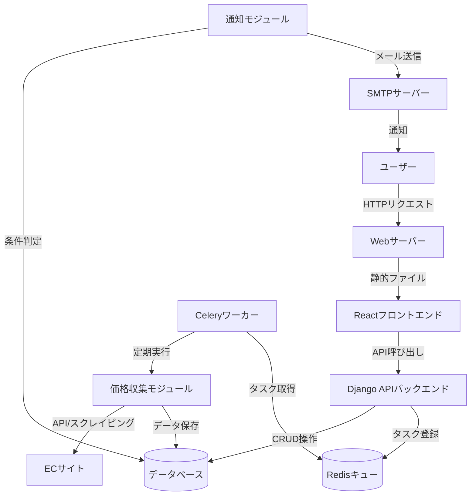
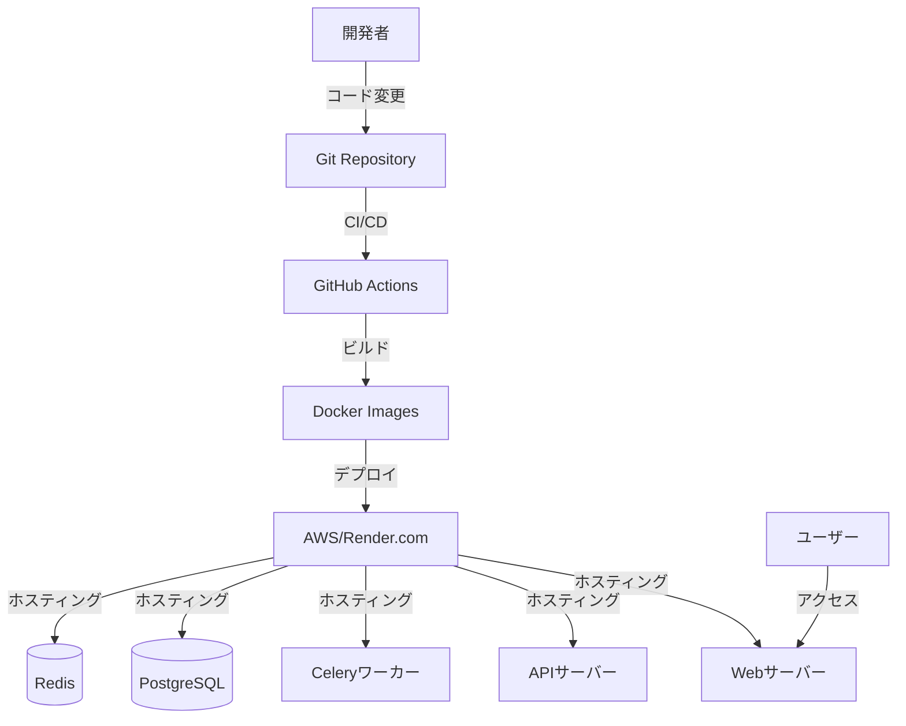
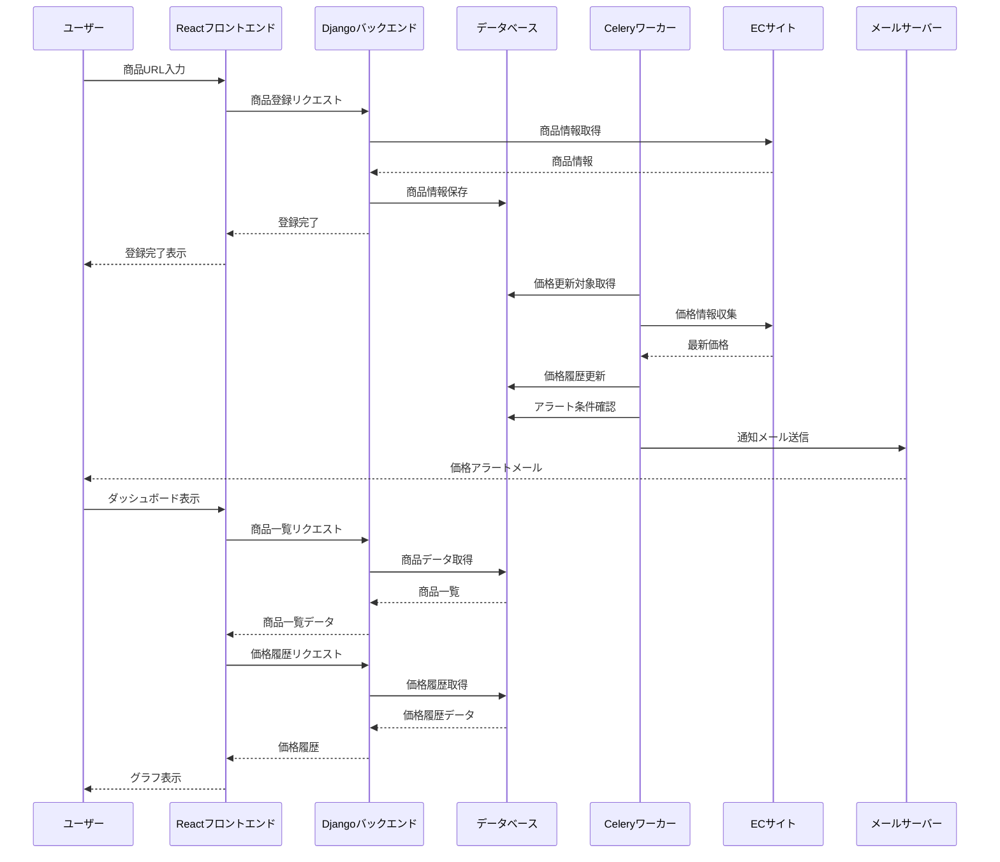
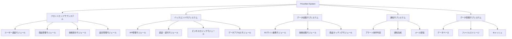
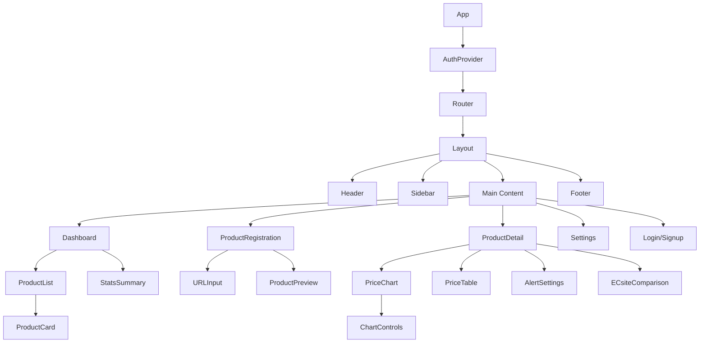
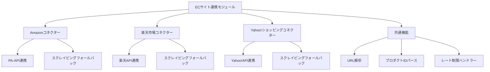
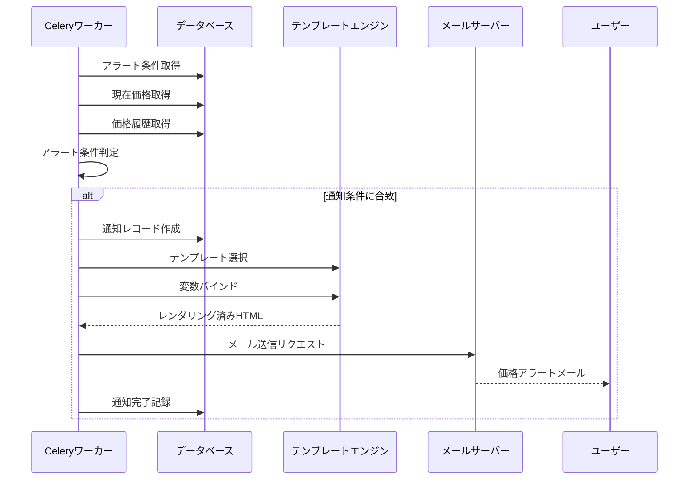

# EC サイト価格追跡システム「PriceAlert」詳細設計書

**バージョン:** 1.0

**作成日:** 2023 年 6 月 10 日

**作成者:** システムエンジニア

## 目次

1. [システム概要](#1-システム概要)
2. [システムアーキテクチャ](#2-システムアーキテクチャ)
3. [コンポーネント設計](#3-コンポーネント設計)
4. [データモデル詳細設計](#4-データモデル詳細設計)
5. [API 設計](#5-api設計)
6. [フロントエンド詳細設計](#6-フロントエンド詳細設計)
7. [バックエンド詳細設計](#7-バックエンド詳細設計)
8. [外部連携設計](#8-外部連携設計)
9. [セキュリティ詳細設計](#9-セキュリティ詳細設計)
10. [テスト詳細計画](#10-テスト詳細計画)
11. [デプロイメント詳細計画](#11-デプロイメント詳細計画)
12. [運用・監視詳細計画](#12-運用監視詳細計画)

## 1. システム概要

### 1.1 目的

「PriceAlert」は、複数の EC サイト（Amazon、楽天市場、Yahoo!ショッピング等）から商品価格情報を自動収集し、価格変動を追跡・分析・通知する Web アプリケーションです。ユーザーが設定した価格閾値を下回った場合に通知し、購入判断をサポートするとともに、アフィリエイトリンクを通じた収益化を実現します。

### 1.2 システム全体像

本システムは以下の主要コンポーネントから構成されます：

1. **ユーザーインターフェース**: React ベースのフロントエンドアプリケーション
2. **バックエンド API**: Django REST Framework によるバックエンドサービス
3. **データ収集サブシステム**: EC サイトから価格情報を収集するスクレイピング・API 連携モジュール
4. **通知サブシステム**: 価格アラート条件判定と通知配信を行うモジュール
5. **データストア**: ユーザー情報、商品情報、価格履歴を管理するデータベース

### 1.3 対象ユーザー

- **一般消費者**: 価格変動を把握し、最適なタイミングでの購入を希望するユーザー
- **特に関心を持つユーザー層**: ガジェット、家電、書籍など価格変動が頻繁に起こる商品カテゴリーに関心を持つユーザー

### 1.4 主要機能概要

- **商品登録・管理**: URL 入力または検索による商品登録と管理
- **価格追跡**: 登録商品の価格変動履歴の記録と表示
- **価格比較**: 複数 EC サイト間の価格比較（表示価格・実質価格）
- **アラート機能**: 設定条件に基づく価格変動通知
- **アフィリエイト機能**: 購入リンクのアフィリエイト変換

## 2. システムアーキテクチャ

### 2.1 全体アーキテクチャ図



### 2.2 アーキテクチャ採用理由

1. **フロントエンド・バックエンド分離**

   - **理由**: ユーザーインターフェースの柔軟な開発と並行開発の効率化
   - **技術選定**: React をフロントエンド Framework として採用（要件変更に伴う）

2. **RESTful API 設計**

   - **理由**: 標準的なインターフェースによる拡張性と保守性の向上
   - **技術選定**: Django REST Framework による効率的な API 実装

3. **非同期タスク処理**

   - **理由**: データ収集や通知処理の負荷分散とユーザーエクスペリエンスの向上
   - **技術選定**: Celery による堅牢なタスク管理

4. **コンテナ化**
   - **理由**: 開発環境と本番環境の一貫性確保、スケーリングの容易化
   - **技術選定**: Docker による環境の統一化

### 2.3 技術スタック詳細

#### 2.3.1 フロントエンド

- **フレームワーク**: React 18.x
- **状態管理**: Redux Toolkit
- **UI コンポーネント**: Material-UI (MUI)
- **グラフ表示**: Recharts
- **API クライアント**: Axios
- **ビルドツール**: Vite
- **型システム**: TypeScript

#### 2.3.2 バックエンド

- **言語**: Python 3.12
- **フレームワーク**: Django 5.0
- **API**: Django REST Framework
- **タスクキュー**: Celery
- **メッセージブローカー**: Redis
- **ORM**: Django ORM
- **スクレイピング**: BeautifulSoup, Selenium（必要に応じて）
- **データ分析**: Pandas, NumPy

#### 2.3.3 データベース

- **開発環境**: SQLite
- **本番環境**: PostgreSQL
- **キャッシュ**: Redis

#### 2.3.4 インフラストラクチャ

- **コンテナ化**: Docker, Docker Compose
- **CI/CD**: GitHub Actions
- **ホスティング**: AWS (EC2, RDS, S3) または Render.com
- **監視**: Django Debug Toolbar (開発環境), Prometheus + Grafana (本番環境)

### 2.4 デプロイメントアーキテクチャ



### 2.5 システム間連携図



## 3. コンポーネント設計

### 3.1 コンポーネント全体構成



### 3.2 フロントエンドコンポーネント詳細

#### 3.2.1. コンポーネント階層構造



#### 3.2.2. 主要コンポーネント機能定義

| コンポーネント名      | 責務                                   | 主な状態                                   | 子コンポーネント                            |
| --------------------- | -------------------------------------- | ------------------------------------------ | ------------------------------------------- |
| `App`                 | アプリケーションのルート、認証状態管理 | `isAuthenticated`                          | `AuthProvider`, `Router`                    |
| `AuthProvider`        | 認証コンテキスト提供                   | `user`, `token`                            | -                                           |
| `Layout`              | 画面レイアウト構成                     | -                                          | `Header`, `Sidebar`, `Main`, `Footer`       |
| `Dashboard`           | ユーザーダッシュボード表示             | `products`, `loading`                      | `ProductList`, `StatsSummary`               |
| `ProductRegistration` | 商品登録フォーム                       | `url`, `product`, `loading`                | `URLInput`, `ProductPreview`                |
| `ProductDetail`       | 商品詳細・価格履歴表示                 | `product`, `priceHistory`, `alertSettings` | `PriceChart`, `PriceTable`, `AlertSettings` |
| `PriceChart`          | 価格履歴グラフ表示                     | `chartData`, `chartOptions`                | `ChartControls`                             |
| `ProductCard`         | 商品カード表示                         | `product`                                  | -                                           |
| `ECsiteComparison`    | EC サイト間価格比較                    | `comparisons`                              | -                                           |

### 3.3 バックエンドコンポーネント詳細

#### 3.3.1. Django アプリケーション構成

```
price_alert/
├── users/             # ユーザー認証・管理
├── products/          # 商品情報管理
├── price_tracking/    # 価格履歴管理
├── alerts/            # アラート設定・通知
├── ec_sites/          # ECサイト連携
└── api/               # REST API定義
```

#### 3.3.2. 主要 Django アプリ機能定義

| アプリ名         | 責務          | 主要モデル                        | 主要ビュー                             |
| ---------------- | ------------- | --------------------------------- | -------------------------------------- |
| `users`          | ユーザー管理  | `User`, `UserSettings`            | `UserViewSet`, `SettingsViewSet`       |
| `products`       | 商品管理      | `Product`, `UserProduct`          | `ProductViewSet`, `UserProductViewSet` |
| `price_tracking` | 価格履歴      | `PriceHistory`, `ProductOnECSite` | `PriceHistoryViewSet`                  |
| `alerts`         | アラート機能  | `Alert`, `Notification`           | `AlertViewSet`, `NotificationViewSet`  |
| `ec_sites`       | EC サイト連携 | `ECSite`, `ProductMapping`        | `ECSiteViewSet`                        |
| `api`            | API 統合      | -                                 | `api_router`                           |

#### 3.3.3. 非同期処理コンポーネント

| タスク名             | 責務                       | スケジュール | リトライ戦略              |
| -------------------- | -------------------------- | ------------ | ------------------------- |
| `collect_prices`     | 登録商品の価格情報収集     | 1 日 1 回    | 最大 3 回, 指数バックオフ |
| `process_alerts`     | アラート条件判定・通知生成 | 1 時間ごと   | 最大 3 回, 5 分間隔       |
| `send_notifications` | 通知メール送信             | イベント駆動 | 最大 5 回, 10 分間隔      |
| `sync_product_info`  | 商品情報更新               | 週 1 回      | 最大 2 回, 1 時間間隔     |

### 3.4 データ収集サブシステム

#### 3.4.1. EC サイト連携モジュール構成



#### 3.4.2. 収集対象データ項目

| データ項目       | 説明                       | 収集元             | 優先度 |
| ---------------- | -------------------------- | ------------------ | ------ |
| `商品名`         | 商品のタイトル             | API/スクレイピング | 高     |
| `販売価格`       | 表示販売価格               | API/スクレイピング | 高     |
| `ポイント還元額` | 購入時に獲得できるポイント | API/スクレイピング | 高     |
| `送料`           | 配送料金                   | API/スクレイピング | 中     |
| `在庫状態`       | 在庫あり/なし              | API/スクレイピング | 中     |
| `商品画像URL`    | 商品画像の URL             | API                | 中     |
| `レビュー評価`   | 星評価                     | API                | 低     |
| `販売者`         | 出品者情報                 | API                | 低     |

#### 3.4.3. 実質価格計算ロジック

```
# 基本計算式
実質価格 = 販売価格 - 獲得ポイント

# ECサイト別の詳細計算
## Amazon
Amazonポイント = 販売価格 × ポイント還元率
※プライム会員特典、キャンペーン対象商品は別途計算

## 楽天市場
楽天ポイント = 販売価格 × 還元率
※SPU（スーパーポイントアッププログラム）は未考慮

## Yahoo!ショッピング
PayPayポイント = 販売価格 × 還元率
※PayPayステップは未考慮
```

### 3.5 通知サブシステム

#### 3.5.1. アラート条件判定ロジック

```python
def should_notify(user_product, current_price, price_history):
    # アラート有効確認
    if not user_product.notification_enabled:
        return False

    # 閾値タイプ判定（表示価格 or 実質価格）
    if user_product.threshold_type == 'list_price':
        target_price = current_price.price
    else:
        target_price = current_price.effective_price

    # 価格閾値判定
    if user_product.price_threshold and target_price <= user_product.price_threshold:
        return True

    # 価格変動率判定
    if user_product.threshold_percentage:
        last_price = get_last_notified_price(user_product)
        if last_price:
            change_percentage = (last_price - target_price) / last_price * 100
            if change_percentage >= user_product.threshold_percentage:
                return True

    return False
```

#### 3.5.2. 通知テンプレート定義

| テンプレート ID   | 通知タイプ   | 内容                         | 変数                                                                        |
| ----------------- | ------------ | ---------------------------- | --------------------------------------------------------------------------- |
| `price_drop`      | 価格下落通知 | 設定価格を下回ったことを通知 | `product_name`, `old_price`, `new_price`, `site_name`, `link`               |
| `price_threshold` | 閾値通知     | 設定閾値に達したことを通知   | `product_name`, `threshold`, `current_price`, `site_name`, `link`           |
| `percentage_drop` | 割合変動通知 | 設定割合以上の値下がりを通知 | `product_name`, `percentage`, `old_price`, `new_price`, `site_name`, `link` |
| `weekly_report`   | 週次レポート | 登録商品の週次価格サマリー   | `products[]`, `period_start`, `period_end`                                  |

#### 3.5.3. 通知配信フロー



## 4. データモデル詳細設計

詳細は [データモデル詳細設計書](./detailed_design_data_model.md) を参照してください。

## 5. API 設計

詳細は [API 設計書](./detailed_design_api.md) を参照してください。

## 6. フロントエンド詳細設計

詳細は [フロントエンド詳細設計書](./detailed_design_frontend.md) を参照してください。

## 7. バックエンド詳細設計

本システムのバックエンドは、Django REST Framework をベースとし、Django ORM を使用したデータアクセス層を実装します。

主な特徴は以下の通りです：

- **Django ORM によるデータアクセス**: 標準的な Django ORM を採用
- **ビジネスロジックの分離**: クリーンアーキテクチャの考え方に基づいた責務の分離
- **非同期タスク処理**: Celery を使用した価格収集と通知処理の効率化

詳細は [バックエンド詳細設計書](./detailed_design_backend.md) を参照してください。

## 8. 外部連携設計

本システムは、複数の外部サービスと連携して価格情報の収集や通知の配信を行います。

主な連携先は以下の通りです：

- **EC サイト API 連携**: Amazon PA-API, 楽天商品検索 API, Yahoo!ショッピング API
- **メール配信サービス**: SendGrid API による通知メール配信
- **認証サービス**: Google OAuth, Twitter OAuth による外部認証

詳細は [外部連携設計書](./detailed_design_external.md) を参照してください。

## 9. セキュリティ詳細設計

本システムでは、ユーザーデータと価格情報を安全に保護するため、複数のセキュリティ対策を講じています。

主なセキュリティ対策は以下の通りです：

- **認証・認可**: JWT 認証と適切な権限管理
- **データ保護**: センシティブデータの暗号化と安全な保存
- **API 保護**: レート制限、CSRF 対策、入力検証
- **インフラストラクチャ**: セキュアなネットワーク設定と環境分離

詳細は [セキュリティ詳細設計書](./detailed_design_security.md) を参照してください。

## 10. テスト詳細計画

本システムの品質を確保するため、複数レベルのテストを実施します。

テスト計画の概要は以下の通りです：

- **単体テスト**: ビジネスロジックとデータアクセス層のテスト
- **統合テスト**: API エンドポイントと外部連携のテスト
- **フロントエンドテスト**: UI コンポーネントとユーザーフローのテスト
- **エンドツーエンドテスト**: 実環境に近い条件での全体機能テスト

詳細は [テスト詳細計画書](./detailed_design_test.md) を参照してください。

## 11. デプロイメント詳細計画

本システムのデプロイメントは、CI/CD パイプラインを活用して自動化します。

デプロイ計画の概要は以下の通りです：

- **環境構成**: 開発、ステージング、本番環境の分離
- **コンテナ化**: Docker を使用したアプリケーションパッケージング
- **CI/CD**: GitHub Actions による自動ビルドとデプロイ
- **データベース移行**: マイグレーションと初期データのシード

詳細は [デプロイメント詳細計画書](./detailed_design_deployment.md) を参照してください。

## 12. 運用・監視詳細計画

本システムの安定稼働を確保するため、包括的な運用・監視計画を策定します。

運用・監視計画の概要は以下の通りです：

- **パフォーマンス監視**: アプリケーションとインフラのメトリクス収集
- **ログ管理**: 集中ログ収集と分析
- **アラート**: 異常検知と通知の自動化
- **バックアップ**: データ保護とリカバリ計画
- **スケーリング**: 負荷に応じた自動スケーリング

詳細は [運用・監視詳細計画書](./detailed_design_operation.md) を参照してください。
