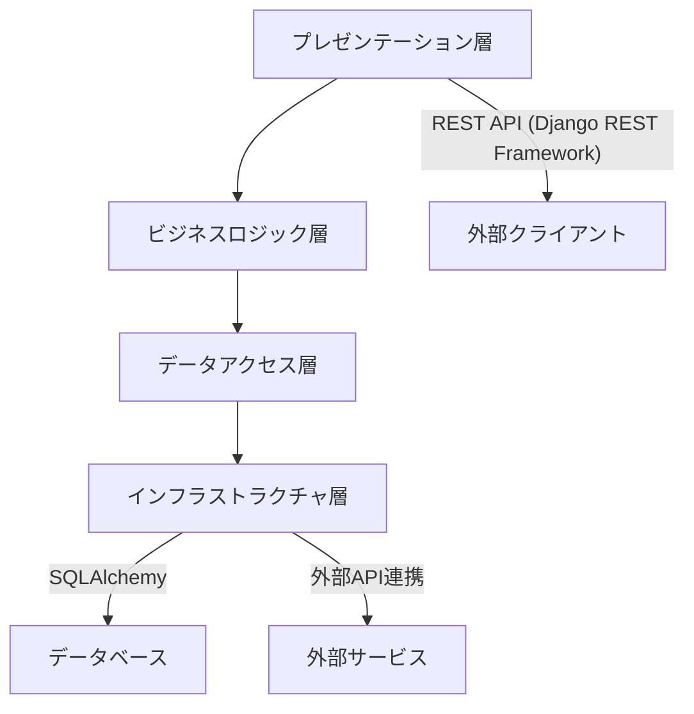
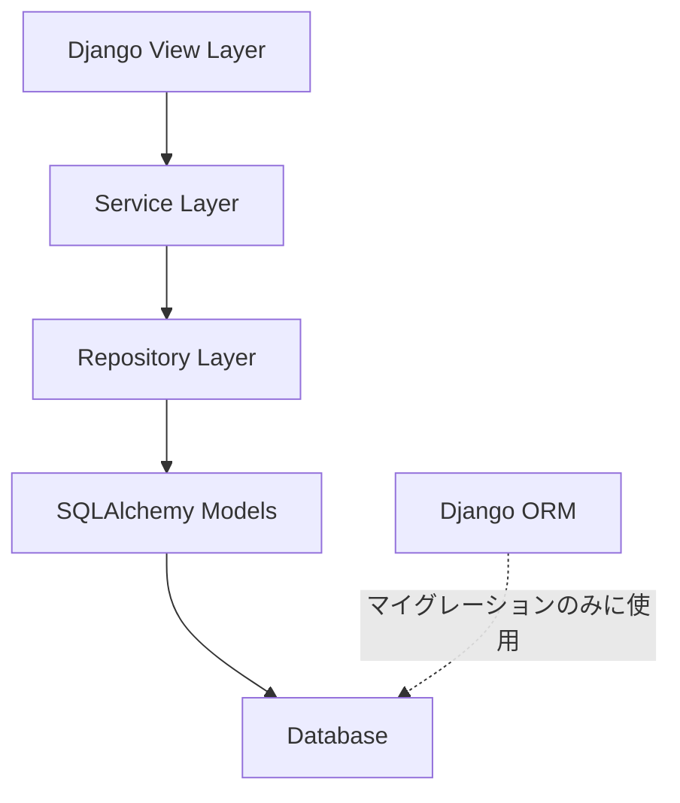

# バックエンド詳細設計書

## 1. 概要

本書では、PriceAlert システムのバックエンド実装に関する詳細設計を記述します。Django フレームワークをベースとしていますが、データアクセス層には SQLAlchemy を採用し、より柔軟でパフォーマンスの高いデータベースアクセスを実現します。

## 2. アーキテクチャ

### 2.1 レイヤー構成

バックエンドは以下の 4 つの主要レイヤーから構成されます：



| レイヤー               | 責務                                 | 主要コンポーネント                 |
| ---------------------- | ------------------------------------ | ---------------------------------- |
| プレゼンテーション層   | API、リクエスト/レスポンス処理       | ViewSets, Serializers, Permissions |
| ビジネスロジック層     | ビジネスルール、ドメインロジック実装 | Services, Tasks                    |
| データアクセス層       | データアクセスとデータ操作           | Repositories, SQLAlchemy Models    |
| インフラストラクチャ層 | 外部サービス連携、データ永続化       | Database, External APIs            |

### 2.2 SQLAlchemy 統合アーキテクチャ

Django REST Framework と SQLAlchemy を統合するアーキテクチャを採用します：



## 3. SQLAlchemy モデル定義

### 3.1 モデル定義の基本構造

```python
from sqlalchemy import Column, Integer, String, ForeignKey, DateTime, Boolean, Numeric
from sqlalchemy.ext.declarative import declarative_base
from sqlalchemy.orm import relationship
from datetime import datetime

Base = declarative_base()

class User(Base):
    __tablename__ = 'users'

    id = Column(Integer, primary_key=True)
    email = Column(String(255), nullable=False, unique=True)
    password = Column(String(255), nullable=False)
    username = Column(String(100), nullable=False)
    is_active = Column(Boolean, nullable=False, default=True)
    is_staff = Column(Boolean, nullable=False, default=False)
    created_at = Column(DateTime, nullable=False, default=datetime.utcnow)
    updated_at = Column(DateTime, nullable=False, default=datetime.utcnow, onupdate=datetime.utcnow)
    last_login = Column(DateTime, nullable=True)

    # リレーションシップ
    settings = relationship("UserSettings", back_populates="user", uselist=False)
    products = relationship("UserProduct", back_populates="user")
    notifications = relationship("Notification", back_populates="user")
    api_tokens = relationship("APIToken", back_populates="user")
```

### 3.2 主要モデル一覧

以下に SQLAlchemy で実装する主要モデルを示します：

1. **User** - ユーザー情報
2. **UserSettings** - ユーザー設定
3. **Product** - 商品情報
4. **ECSite** - EC サイト情報
5. **ProductOnECSite** - 商品と EC サイトの紐付け
6. **UserProduct** - ユーザーと商品の紐付け
7. **PriceHistory** - 価格履歴
8. **Alert** - アラート設定
9. **Notification** - 通知
10. **APIToken** - API トークン
11. **ProductMapping** - 商品マッピング

## 4. データアクセス層

### 4.1 リポジトリパターン

データアクセスはリポジトリパターンを採用し、ビジネスロジック層からデータストアの詳細を隠蔽します：

```python
from abc import ABC, abstractmethod
from typing import List, Optional

class UserRepository(ABC):
    @abstractmethod
    def get_by_id(self, user_id: int) -> Optional[User]:
        pass

    @abstractmethod
    def get_by_email(self, email: str) -> Optional[User]:
        pass

    @abstractmethod
    def create(self, user_data: dict) -> User:
        pass

    @abstractmethod
    def update(self, user: User, user_data: dict) -> User:
        pass

class SQLAlchemyUserRepository(UserRepository):
    def __init__(self, db_session):
        self.db_session = db_session

    def get_by_id(self, user_id: int) -> Optional[User]:
        return self.db_session.query(User).filter(User.id == user_id).first()

    def get_by_email(self, email: str) -> Optional[User]:
        return self.db_session.query(User).filter(User.email == email).first()

    def create(self, user_data: dict) -> User:
        user = User(**user_data)
        self.db_session.add(user)
        self.db_session.commit()
        return user

    def update(self, user: User, user_data: dict) -> User:
        for key, value in user_data.items():
            setattr(user, key, value)
        self.db_session.commit()
        return user
```

### 4.2 セッション管理

SQLAlchemy のセッション管理は以下のようにミドルウェアで実装します：

```python
from sqlalchemy import create_engine
from sqlalchemy.orm import sessionmaker, scoped_session
from django.conf import settings
from django.utils.deprecation import MiddlewareMixin

engine = create_engine(settings.DATABASE_URL)
SessionFactory = sessionmaker(bind=engine)
ScopedSession = scoped_session(SessionFactory)

class SQLAlchemySessionMiddleware(MiddlewareMixin):
    def process_request(self, request):
        request.db_session = ScopedSession()

    def process_response(self, request, response):
        if hasattr(request, 'db_session'):
            request.db_session.close()
        return response

    def process_exception(self, request, exception):
        if hasattr(request, 'db_session'):
            request.db_session.rollback()
            request.db_session.close()
```

## 5. ビジネスロジック層

### 5.1 サービスクラス

ビジネスロジックはサービスクラスに実装します：

```python
class ProductService:
    def __init__(self, product_repository, user_product_repository, ec_connector_factory):
        self.product_repository = product_repository
        self.user_product_repository = user_product_repository
        self.ec_connector_factory = ec_connector_factory

    def register_product_from_url(self, user_id: int, url: str) -> UserProduct:
        # URLからECサイト識別
        ec_site = self._identify_ec_site(url)

        # ECサイトコネクター取得
        connector = self.ec_connector_factory.get_connector(ec_site.code)

        # 商品情報取得
        product_info = connector.fetch_product_info(url)

        # 既存商品確認またはDB登録
        product = self.product_repository.get_by_code(product_info['code'])
        if not product:
            product = self.product_repository.create({
                'name': product_info['name'],
                'description': product_info['description'],
                'image_url': product_info['image_url'],
                'manufacturer': product_info['manufacturer'],
                'model_number': product_info['model_number'],
                'jan_code': product_info['jan_code']
            })

        # ユーザーと商品の紐付け
        user_product = self.user_product_repository.get_by_user_and_product(user_id, product.id)
        if not user_product:
            user_product = self.user_product_repository.create({
                'user_id': user_id,
                'product_id': product.id,
                'notification_enabled': True
            })

        return user_product
```

### 5.2 Celery タスク

非同期処理は Celery タスクとして実装します：

```python
@app.task(bind=True, max_retries=3, default_retry_delay=300)
def collect_prices(self):
    try:
        # セッション作成
        session = SessionFactory()

        # リポジトリ初期化
        product_repo = SQLAlchemyProductOnECSiteRepository(session)
        price_repo = SQLAlchemyPriceHistoryRepository(session)
        ec_factory = ECConnectorFactory()

        # 更新対象商品取得
        products = product_repo.get_products_for_update()

        for product in products:
            # ECサイトコネクター取得
            connector = ec_factory.get_connector(product.ec_site.code)

            # 価格情報取得
            try:
                price_info = connector.fetch_price(product.product_url)

                # 価格履歴登録
                price_repo.create({
                    'product_on_ec_site_id': product.id,
                    'price': price_info['price'],
                    'points': price_info['points'],
                    'effective_price': price_info['price'] - price_info['points'],
                    'captured_at': datetime.utcnow()
                })

                # 最新価格更新
                product_repo.update(product, {
                    'current_price': price_info['price'],
                    'current_points': price_info['points'],
                    'effective_price': price_info['price'] - price_info['points'],
                    'last_updated': datetime.utcnow()
                })

            except Exception as e:
                # 個別の商品でエラーが発生しても他の商品は処理を継続
                logger.error(f"Error collecting price for product {product.id}: {str(e)}")

        session.commit()

    except Exception as e:
        session.rollback()
        raise self.retry(exc=e)

    finally:
        session.close()
```

## 6. プレゼンテーション層

### 6.1 Django REST Framework との統合

Django REST Framework のビューは以下のようにサービスを利用します：

```python
from rest_framework import viewsets, status
from rest_framework.response import Response
from rest_framework.permissions import IsAuthenticated
from rest_framework.decorators import action
from django.conf import settings

class ProductViewSet(viewsets.ViewSet):
    permission_classes = [IsAuthenticated]

    def get_repositories(self, request):
        product_repo = SQLAlchemyProductRepository(request.db_session)
        user_product_repo = SQLAlchemyUserProductRepository(request.db_session)
        return product_repo, user_product_repo

    def get_service(self, request):
        product_repo, user_product_repo = self.get_repositories(request)
        ec_factory = ECConnectorFactory()
        return ProductService(product_repo, user_product_repo, ec_factory)

    def list(self, request):
        _, user_product_repo = self.get_repositories(request)
        products = user_product_repo.get_by_user_id(request.user.id)
        serializer = UserProductSerializer(products, many=True)
        return Response(serializer.data)

    def create(self, request):
        service = self.get_service(request)

        try:
            user_product = service.register_product_from_url(
                request.user.id,
                request.data.get('url')
            )

            serializer = UserProductSerializer(user_product)
            return Response(serializer.data, status=status.HTTP_201_CREATED)

        except InvalidURLException:
            return Response(
                {'error': 'URLの形式が正しくありません。'},
                status=status.HTTP_400_BAD_REQUEST
            )
        except ProductNotFoundException:
            return Response(
                {'error': '商品情報が取得できませんでした。'},
                status=status.HTTP_404_NOT_FOUND
            )
```

### 6.2 シリアライザー

データの変換とバリデーションは Django REST Framework のシリアライザーを使用します：

```python
from rest_framework import serializers

class UserProductSerializer(serializers.Serializer):
    id = serializers.IntegerField(read_only=True)
    product = ProductSerializer(read_only=True)
    price_threshold = serializers.DecimalField(max_digits=10, decimal_places=2, allow_null=True, required=False)
    threshold_type = serializers.ChoiceField(choices=['list_price', 'effective_price'], default='list_price')
    threshold_percentage = serializers.IntegerField(allow_null=True, required=False)
    notification_enabled = serializers.BooleanField(default=True)

    def update(self, instance, validated_data):
        # このメソッドはデータ更新時に呼ばれるが、実際の更新処理はサービスに委譲
        return instance
```

## 7. SQLAlchemy と Django の統合ポイント

### 7.1 マイグレーション管理

スキーマ管理は Django マイグレーションを使用します：

```
# DjangoのORM定義 (models.py)
from django.db import models

class User(models.Model):
    email = models.EmailField(max_length=255, unique=True)
    password = models.CharField(max_length=255)
    username = models.CharField(max_length=100)
    is_active = models.BooleanField(default=True)
    is_staff = models.BooleanField(default=False)
    created_at = models.DateTimeField(auto_now_add=True)
    updated_at = models.DateTimeField(auto_now=True)
    last_login = models.DateTimeField(null=True, blank=True)

# Djangoマイグレーションで作成したスキーマに対して、SQLAlchemyのモデルを定義
```

### 7.2 トランザクション管理

トランザクション管理は以下のように実装します：

```python
from functools import wraps

def transaction(view_func):
    @wraps(view_func)
    def _wrapped_view(request, *args, **kwargs):
        try:
            response = view_func(request, *args, **kwargs)
            if hasattr(request, 'db_session'):
                request.db_session.commit()
            return response
        except Exception as e:
            if hasattr(request, 'db_session'):
                request.db_session.rollback()
            raise
    return _wrapped_view
```

## 8. パフォーマンス最適化

### 8.1 クエリ最適化

SQLAlchemy の機能を活用したクエリ最適化を実現します：

```python
# N+1問題を回避するためのクエリ例
def get_user_products_with_details(self, user_id: int):
    return self.db_session.query(UserProduct)\
        .options(
            joinedload(UserProduct.product),
            joinedload(UserProduct.product).joinedload(Product.product_on_ec_sites),
            joinedload(UserProduct.product).joinedload(Product.product_on_ec_sites).joinedload(ProductOnECSite.ec_site)
        )\
        .filter(UserProduct.user_id == user_id)\
        .all()
```

### 8.2 キャッシュ戦略

データベースアクセス削減のためのキャッシュ戦略：

```python
class CachedProductRepository:
    def __init__(self, repository, cache):
        self.repository = repository
        self.cache = cache

    def get_by_id(self, product_id: int) -> Optional[Product]:
        cache_key = f'product:{product_id}'
        product = self.cache.get(cache_key)
        if not product:
            product = self.repository.get_by_id(product_id)
            if product:
                self.cache.set(cache_key, product, timeout=3600)  # 1時間キャッシュ
        return product
```

## 9. エラー処理

### 9.1 例外ハンドリング

アプリケーション固有の例外を定義します：

```python
class PriceAlertException(Exception):
    """アプリケーション基底例外"""
    pass

class ProductNotFoundException(PriceAlertException):
    """商品が見つからない場合の例外"""
    pass

class InvalidURLException(PriceAlertException):
    """無効なURLの場合の例外"""
    pass

class ECServiceUnavailableException(PriceAlertException):
    """ECサイトサービスが利用できない場合の例外"""
    pass
```

### 9.2 グローバル例外ハンドラー

Django REST Framework のグローバル例外ハンドラー：

```python
from rest_framework.views import exception_handler
from rest_framework.response import Response
from rest_framework import status

def custom_exception_handler(exc, context):
    # 標準のハンドラーを呼び出す
    response = exception_handler(exc, context)

    # レスポンスがない場合は、カスタム例外のハンドリング
    if response is None:
        if isinstance(exc, ProductNotFoundException):
            response = Response(
                {'error': str(exc) or '商品が見つかりません。'},
                status=status.HTTP_404_NOT_FOUND
            )
        elif isinstance(exc, InvalidURLException):
            response = Response(
                {'error': str(exc) or 'URLの形式が正しくありません。'},
                status=status.HTTP_400_BAD_REQUEST
            )
        elif isinstance(exc, ECServiceUnavailableException):
            response = Response(
                {'error': str(exc) or 'ECサイトサービスが一時的に利用できません。'},
                status=status.HTTP_503_SERVICE_UNAVAILABLE
            )

    return response
```

## 10. テスト方針

### 10.1 単体テスト

SQLAlchemy リポジトリの単体テスト例：

```python
from unittest import TestCase
from unittest.mock import Mock, patch
import pytest
from sqlalchemy import create_engine
from sqlalchemy.orm import sessionmaker

class TestSQLAlchemyUserRepository(TestCase):
    def setUp(self):
        # インメモリSQLiteデータベースを使用
        self.engine = create_engine('sqlite:///:memory:')
        Base.metadata.create_all(self.engine)
        self.Session = sessionmaker(bind=self.engine)
        self.session = self.Session()

        # テスト対象リポジトリの作成
        self.repository = SQLAlchemyUserRepository(self.session)

        # テストデータの作成
        self.test_user = User(
            email='test@example.com',
            password='password_hash',
            username='testuser',
            is_active=True
        )
        self.session.add(self.test_user)
        self.session.commit()

    def tearDown(self):
        self.session.close()

    def test_get_by_id(self):
        # 存在するユーザーのID検索
        user = self.repository.get_by_id(self.test_user.id)
        self.assertIsNotNone(user)
        self.assertEqual(user.email, 'test@example.com')

        # 存在しないユーザーのID検索
        user = self.repository.get_by_id(999)
        self.assertIsNone(user)

    def test_get_by_email(self):
        # 存在するユーザーのメール検索
        user = self.repository.get_by_email('test@example.com')
        self.assertIsNotNone(user)
        self.assertEqual(user.id, self.test_user.id)

        # 存在しないユーザーのメール検索
        user = self.repository.get_by_email('nonexistent@example.com')
        self.assertIsNone(user)
```
