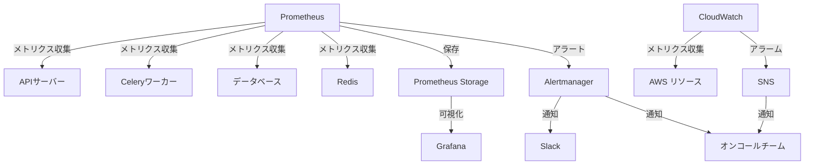
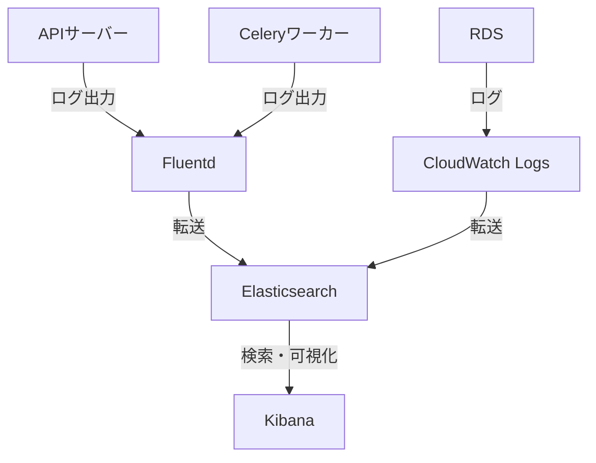
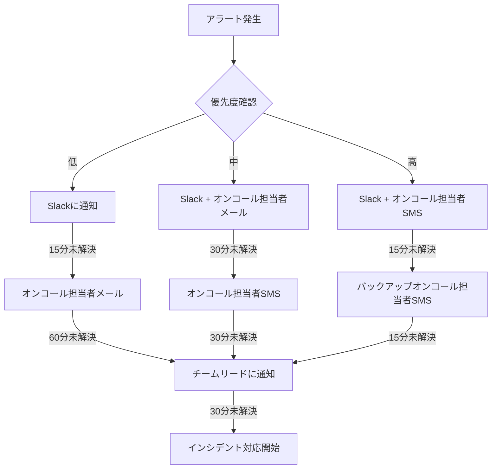
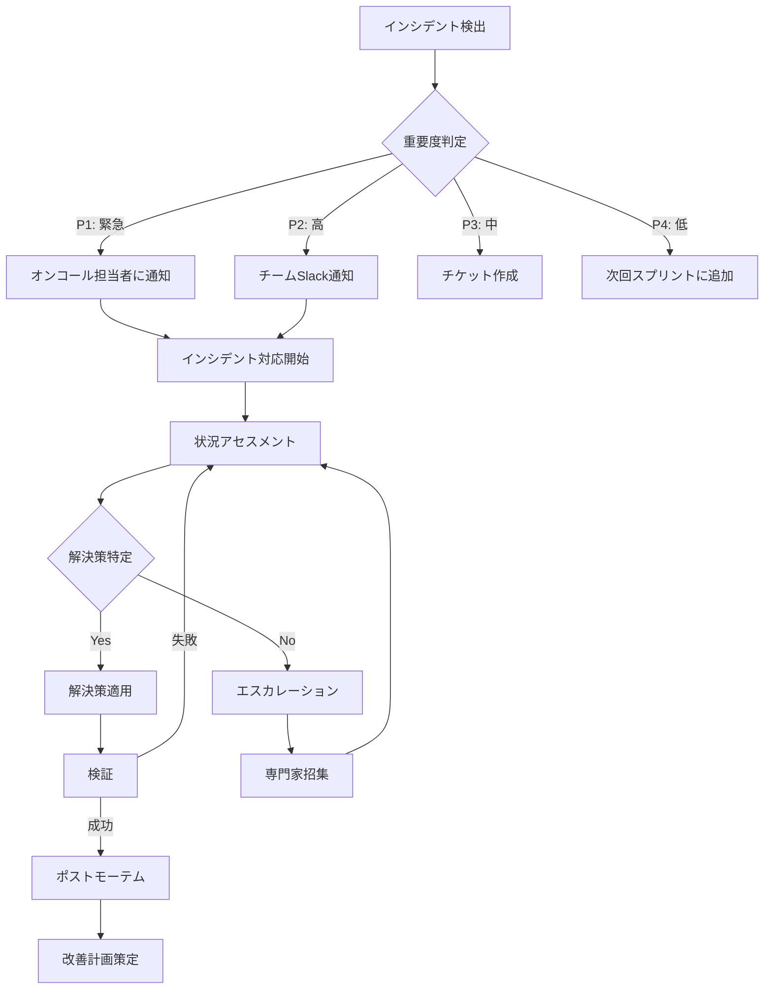
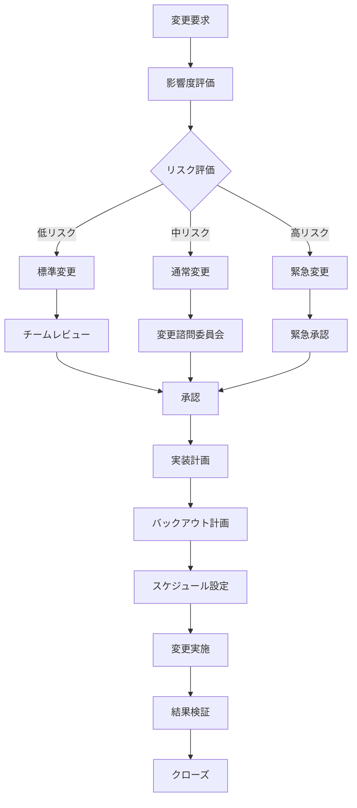

# 運用・監視詳細計画書

## 1. 概要

本書では、PriceAlert システムの安定稼働のための運用・監視計画について詳細に記述します。アプリケーションおよびインフラのパフォーマンス監視、ログ管理、アラート設定、バックアップ戦略、およびスケーリング計画について説明します。

## 2. 監視戦略

### 2.1 監視対象一覧

| カテゴリ             | 監視対象             | 主要指標         | 閾値       | アラート優先度 |
| -------------------- | -------------------- | ---------------- | ---------- | -------------- |
| インフラストラクチャ | EC2/ECS インスタンス | CPU 使用率       | 80%        | 中             |
| インフラストラクチャ | EC2/ECS インスタンス | メモリ使用率     | 85%        | 中             |
| インフラストラクチャ | RDS                  | CPU 使用率       | 75%        | 高             |
| インフラストラクチャ | RDS                  | ディスク使用率   | 80%        | 高             |
| インフラストラクチャ | RDS                  | フリーメモリ     | 10%以下    | 高             |
| インフラストラクチャ | Redis                | メモリ使用率     | 70%        | 中             |
| アプリケーション     | API サーバー         | レスポンスタイム | 500ms 以上 | 中             |
| アプリケーション     | API サーバー         | エラーレート     | 1%以上     | 高             |
| アプリケーション     | Celery ワーカー      | キュー長         | 1000 以上  | 中             |
| アプリケーション     | Celery ワーカー      | タスク実行時間   | 60 秒以上  | 低             |
| ビジネス指標         | スクレイピング成功率 | 成功率           | 95%以下    | 高             |
| ビジネス指標         | 通知配信成功率       | 成功率           | 98%以下    | 高             |

### 2.2 監視ダッシュボード



### 2.3 Grafana ダッシュボード構成

主要なダッシュボードを以下のように構成します：

1. **システム概要ダッシュボード**

   - 全体的なシステム健全性
   - 主要サービスの稼働状態
   - エラー数の概要

2. **API サーバーダッシュボード**

   - リクエスト数/秒
   - エンドポイント別レスポンスタイム
   - エラーレート
   - CPU/メモリ使用率

3. **Celery ワーカーダッシュボード**

   - キュー長
   - タスク処理数/秒
   - タスク処理時間
   - 失敗タスク数

4. **データベースダッシュボード**

   - 接続数
   - クエリパフォーマンス
   - インデックス使用状況
   - ディスク使用量

5. **ビジネス指標ダッシュボード**
   - アクティブユーザー数
   - 登録商品数
   - 価格変動検知数
   - 通知送信数

## 3. ログ管理

### 3.1 ログ収集アーキテクチャ



### 3.2 ログレベルとカテゴリ

| カテゴリ         | ログレベル | 内容               | 保管期間 |
| ---------------- | ---------- | ------------------ | -------- |
| アプリケーション | INFO       | 通常の処理状況     | 30 日    |
| アプリケーション | WARNING    | 潜在的な問題       | 90 日    |
| アプリケーション | ERROR      | エラーイベント     | 180 日   |
| アプリケーション | CRITICAL   | 重大な障害         | 365 日   |
| セキュリティ     | INFO       | 認証・認可イベント | 365 日   |
| セキュリティ     | WARNING    | セキュリティ警告   | 365 日   |
| セキュリティ     | ERROR      | セキュリティ違反   | 365 日   |
| アクセス         | INFO       | API アクセスログ   | 90 日    |
| データベース     | INFO       | スロークエリ       | 90 日    |

### 3.3 ログフォーマット

JSON 形式のログを採用し、構造化されたログ分析を可能にします：

```python
import json
import logging
import time
from datetime import datetime

class StructuredLogFormatter(logging.Formatter):
    def format(self, record):
        log_data = {
            'timestamp': datetime.utcnow().isoformat(),
            'level': record.levelname,
            'logger': record.name,
            'message': record.getMessage(),
            'module': record.module,
            'function': record.funcName,
            'line': record.lineno,
        }

        # 例外情報の追加
        if record.exc_info:
            log_data['exception'] = {
                'type': record.exc_info[0].__name__,
                'message': str(record.exc_info[1]),
                'traceback': self.formatException(record.exc_info)
            }

        # カスタムフィールドの追加
        if hasattr(record, 'request_id'):
            log_data['request_id'] = record.request_id

        if hasattr(record, 'user_id'):
            log_data['user_id'] = record.user_id

        return json.dumps(log_data)
```

## 4. アラート設定

### 4.1 アラート配信チャネル

| チャネル  | 用途                 | 受信者                          |
| --------- | -------------------- | ------------------------------- |
| Slack     | 低・中優先度アラート | 開発チーム全員                  |
| メール    | 高優先度アラート     | オンコール担当者                |
| SMS       | 緊急アラート         | オンコール担当者                |
| PagerDuty | 致命的なシステム障害 | オンコール担当者 + チームリード |

### 4.2 アラートルール設定

```yaml
# Prometheus Alert Rules
groups:
  - name: api_alerts
    rules:
      - alert: HighErrorRate
        expr: sum(rate(http_requests_total{status=~"5.."}[5m])) / sum(rate(http_requests_total[5m])) * 100 > 1
        for: 5m
        labels:
          severity: high
        annotations:
          summary: "High API Error Rate"
          description: "Error rate is {{ $value }}%, which is above 1% threshold."

      - alert: SlowResponseTime
        expr: histogram_quantile(0.95, sum(rate(http_request_duration_seconds_bucket[5m])) by (le)) > 0.5
        for: 5m
        labels:
          severity: medium
        annotations:
          summary: "Slow API Response Time"
          description: "95th percentile of response time is {{ $value }}s, which is above 0.5s threshold."

  - name: database_alerts
    rules:
      - alert: HighDatabaseCPU
        expr: avg(rate(node_cpu{mode!="idle",instance=~"database.*"}[5m])) by (instance) * 100 > 75
        for: 15m
        labels:
          severity: high
        annotations:
          summary: "High Database CPU"
          description: "Database CPU usage is {{ $value }}%, which is above 75% threshold."

      - alert: LowDatabaseDiskSpace
        expr: node_filesystem_avail_bytes{mountpoint="/data",instance=~"database.*"} / node_filesystem_size_bytes{mountpoint="/data"} * 100 < 20
        for: 10m
        labels:
          severity: high
        annotations:
          summary: "Low Database Disk Space"
          description: "Database has {{ $value }}% free disk space, which is below 20% threshold."

  - name: celery_alerts
    rules:
      - alert: LongCeleryQueue
        expr: sum(celery_tasks_queued_total) > 1000
        for: 15m
        labels:
          severity: medium
        annotations:
          summary: "Long Celery Queue"
          description: "Celery queue has {{ $value }} tasks, which is above 1000 threshold."

      - alert: HighCeleryTaskFailureRate
        expr: sum(rate(celery_tasks_failed_total[10m])) / sum(rate(celery_tasks_executed_total[10m])) * 100 > 5
        for: 10m
        labels:
          severity: high
        annotations:
          summary: "High Celery Task Failure Rate"
          description: "Celery task failure rate is {{ $value }}%, which is above 5% threshold."
```

### 4.3 エスカレーションポリシー



## 5. バックアップと復旧

### 5.1 バックアップ戦略

| データ種別             | バックアップ方式          | 頻度         | 保持期間 | 保管場所        |
| ---------------------- | ------------------------- | ------------ | -------- | --------------- |
| データベース           | スナップショット          | 毎日         | 14 日間  | AWS S3          |
| データベース           | 論理バックアップ(pg_dump) | 毎週         | 90 日間  | AWS S3          |
| データベース           | 継続的 WAL アーカイブ     | リアルタイム | 7 日間   | AWS S3          |
| アプリケーションデータ | S3 バックアップ           | 毎日         | 30 日間  | 別リージョン S3 |
| 設定ファイル           | Git リポジトリ BACKUP     | 変更時       | 無期限   | GitHub + S3     |

### 5.2 復旧計画

#### 5.2.1 データベース復旧手順

```bash
#!/bin/bash
# RDS データベース復旧スクリプト

# 引数確認
if [ "$#" -ne 2 ]; then
    echo "Usage: $0 <snapshot-identifier> <target-instance-identifier>"
    exit 1
fi

SNAPSHOT_ID=$1
TARGET_INSTANCE=$2

# スナップショットからインスタンス復元
echo "Restoring RDS instance from snapshot $SNAPSHOT_ID to $TARGET_INSTANCE..."
aws rds restore-db-instance-from-db-snapshot \
    --db-instance-identifier $TARGET_INSTANCE \
    --db-snapshot-identifier $SNAPSHOT_ID \
    --db-instance-class db.t3.large

# インスタンス作成完了を待機
echo "Waiting for instance to become available..."
aws rds wait db-instance-available --db-instance-identifier $TARGET_INSTANCE

# セキュリティグループ設定
echo "Configuring security group..."
aws rds modify-db-instance \
    --db-instance-identifier $TARGET_INSTANCE \
    --vpc-security-group-ids sg-01234567890abcdef \
    --apply-immediately

echo "Restoration complete. New instance is available at:"
aws rds describe-db-instances \
    --db-instance-identifier $TARGET_INSTANCE \
    --query "DBInstances[0].Endpoint.Address" \
    --output text
```

#### 5.2.2 ポイントインタイム復旧

```bash
#!/bin/bash
# 特定時点へのポイントインタイム復旧スクリプト

# 引数確認
if [ "$#" -ne 2 ]; then
    echo "Usage: $0 <target-instance-identifier> <restore-time>"
    echo "Example: $0 price-alert-recovered '2023-06-15T08:45:00Z'"
    exit 1
fi

TARGET_INSTANCE=$1
RESTORE_TIME=$2

# ポイントインタイム復旧の実行
echo "Performing point-in-time recovery to $RESTORE_TIME..."
aws rds restore-db-instance-to-point-in-time \
    --source-db-instance-identifier price-alert-production \
    --target-db-instance-identifier $TARGET_INSTANCE \
    --restore-time $RESTORE_TIME \
    --db-instance-class db.t3.large

# インスタンス作成完了を待機
echo "Waiting for instance to become available..."
aws rds wait db-instance-available --db-instance-identifier $TARGET_INSTANCE

echo "Point-in-time recovery complete. New instance is available at:"
aws rds describe-db-instances \
    --db-instance-identifier $TARGET_INSTANCE \
    --query "DBInstances[0].Endpoint.Address" \
    --output text
```

### 5.3 定期的な復旧訓練

四半期に一度、以下の復旧訓練を実施します：

1. **データベース完全復元訓練**: 本番データのスナップショットから検証環境に復元
2. **ポイントインタイム復旧訓練**: 特定の時点に検証環境のデータベースを復元
3. **リージョン間復旧訓練**: 別リージョンでのインフラ再構築と復旧
4. **障害インジェクション訓練**: カオスエンジニアリングによる予期せぬ障害対応

## 6. キャパシティプランニングとスケーリング

### 6.1 自動スケーリング設定

```yaml
# AWS Auto Scaling 設定例
Resources:
  APIServiceAutoScalingTarget:
    Type: AWS::ApplicationAutoScaling::ScalableTarget
    Properties:
      MaxCapacity: 10
      MinCapacity: 2
      ResourceId: !Sub service/${ECSCluster}/${APIService}
      ScalableDimension: ecs:service:DesiredCount
      ServiceNamespace: ecs

  CPUScalingPolicy:
    Type: AWS::ApplicationAutoScaling::ScalingPolicy
    Properties:
      PolicyName: CPUScalingPolicy
      PolicyType: TargetTrackingScaling
      ScalingTargetId: !Ref APIServiceAutoScalingTarget
      TargetTrackingScalingPolicyConfiguration:
        PredefinedMetricSpecification:
          PredefinedMetricType: ECSServiceAverageCPUUtilization
        TargetValue: 70.0
        ScaleOutCooldown: 60
        ScaleInCooldown: 300

  RequestCountScalingPolicy:
    Type: AWS::ApplicationAutoScaling::ScalingPolicy
    Properties:
      PolicyName: RequestCountScalingPolicy
      PolicyType: TargetTrackingScaling
      ScalingTargetId: !Ref APIServiceAutoScalingTarget
      TargetTrackingScalingPolicyConfiguration:
        PredefinedMetricSpecification:
          PredefinedMetricType: ALBRequestCountPerTarget
          ResourceLabel: !Sub ${LoadBalancer}/${TargetGroup}
        TargetValue: 1000.0
        ScaleOutCooldown: 60
        ScaleInCooldown: 300
```

### 6.2 リソース使用量予測

```python
import pandas as pd
import numpy as np
from prophet import Prophet

def forecast_resource_usage(metric_data, periods=30, interval_width=0.95):
    """
    Prophetを使用したリソース使用量の予測

    Parameters:
    metric_data: DataFrame with 'ds' (date) and 'y' (metric value) columns
    periods: Number of days to forecast
    interval_width: Width of uncertainty intervals

    Returns:
    DataFrame with forecast
    """
    # Prophetモデルの初期化
    model = Prophet(interval_width=interval_width)

    # 週次パターンの追加
    model.add_seasonality(
        name='weekly',
        period=7,
        fourier_order=5
    )

    # 日内パターンの追加（時間単位データの場合）
    if 'hour' in metric_data['ds'].dt.hour.unique().shape[0] > 1:
        model.add_seasonality(
            name='daily',
            period=1,
            fourier_order=10
        )

    # モデルの学習
    model.fit(metric_data)

    # 将来予測用のデータフレーム作成
    future = model.make_future_dataframe(periods=periods)

    # 予測の実行
    forecast = model.predict(future)

    return forecast
```

### 6.3 容量計画マトリックス

| リソース        | 現在使用量      | 増加率 | 6 ヶ月後予測    | スケーリング閾値        | スケーリング方法     |
| --------------- | --------------- | ------ | --------------- | ----------------------- | -------------------- |
| API サーバー    | 4 インスタンス  | 月 10% | 7 インスタンス  | CPU 70%, 1000 req/min   | 自動水平スケーリング |
| Celery ワーカー | 3 インスタンス  | 月 15% | 8 インスタンス  | キュー長 500            | 自動水平スケーリング |
| RDS             | db.t3.large     | 月 20% | db.t3.xlarge    | CPU 70%, ストレージ 80% | 手動垂直スケーリング |
| Redis           | cache.t3.medium | 月 5%  | cache.t3.medium | メモリ 70%              | 自動水平スケーリング |
| S3 ストレージ   | 50GB            | 月 30% | 270GB           | -                       | 自動拡張             |

## 7. 運用手順

### 7.1 定期メンテナンス計画

| タスク                       | 頻度         | 担当者           | 手順書リンク                                               |
| ---------------------------- | ------------ | ---------------- | ---------------------------------------------------------- |
| データベースバックアップ検証 | 毎週         | DBA              | [DB Backup Verification](./procedures/db_backup_verify.md) |
| インデックス最適化           | 毎月         | DBA              | [Index Optimization](./procedures/index_optimize.md)       |
| セキュリティパッチ適用       | 毎月         | インフラ担当     | [Security Patching](./procedures/security_patch.md)        |
| ログローテーション           | 毎日（自動） | システム         | [Log Rotation](./procedures/log_rotation.md)               |
| パフォーマンス分析           | 毎週         | バックエンド担当 | [Performance Analysis](./procedures/perf_analysis.md)      |
| モニタリングアラート見直し   | 四半期       | SRE 担当         | [Alert Review](./procedures/alert_review.md)               |

### 7.2 インシデント対応フロー



### 7.3 変更管理プロセス



## 8. ドキュメント管理

### 8.1 運用ドキュメント一覧

| ドキュメント名                   | 目的                           | 更新頻度 | 責任者       |
| -------------------------------- | ------------------------------ | -------- | ------------ |
| システム構成図                   | システム全体構成の理解         | 変更時   | インフラ担当 |
| 運用手順書                       | 日常的な運用タスクの標準化     | 四半期   | SRE 担当     |
| 障害対応マニュアル               | インシデント発生時の対応フロー | 半年     | SRE 担当     |
| データバックアップ・リストア手順 | データ保護とリカバリ方法       | 四半期   | DBA          |
| モニタリング設定ガイド           | 監視システムの設定方法         | 変更時   | SRE 担当     |
| オンコールハンドブック           | オンコール担当者向けガイド     | 四半期   | チームリード |

### 8.2 ナレッジベース管理

運用知識は以下の形で管理・共有します：

1. **Wiki**: チーム向け技術文書とベストプラクティス
2. **障害ポストモーテム**: 過去の障害とその解決策、教訓
3. **運用メトリクスダッシュボード**: 重要な運用指標の可視化
4. **トラブルシューティングガイド**: 一般的な問題の解決手順

## 9. 継続的改善

### 9.1 SLI/SLO/SLA 定義

| サービス     | SLI（指標）        | SLO（目標） | SLA（保証） |
| ------------ | ------------------ | ----------- | ----------- |
| API サービス | 可用性             | 99.9%       | 99.5%       |
| API サービス | 平均応答時間       | 200ms       | 500ms       |
| API サービス | 成功率             | 99.95%      | 99.9%       |
| 価格収集     | 収集成功率         | 98%         | 95%         |
| 価格アラート | 通知遅延           | 10 分以内   | 30 分以内   |
| ウェブ UI    | ページ読み込み時間 | 2 秒以内    | 5 秒以内    |

### 9.2 エラーバジェット

```python
def calculate_error_budget(slo_percentage, time_period_hours):
    """
    エラーバジェットの計算

    Parameters:
    slo_percentage: SLOの割合（例: 99.9）
    time_period_hours: 期間（時間）

    Returns:
    許容ダウンタイム（分）
    """
    total_minutes = time_period_hours * 60
    allowed_downtime = total_minutes * (100 - slo_percentage) / 100
    return allowed_downtime

# 例: 99.9% SLOの月間エラーバジェット
monthly_error_budget = calculate_error_budget(99.9, 30 * 24)
print(f"月間エラーバジェット: {monthly_error_budget:.2f}分")
```

### 9.3 四半期運用レビュー

四半期ごとに以下の項目をレビューし、改善計画を策定します：

1. **SLO 達成状況**: 各サービスの SLO 達成率の評価
2. **インシデント分析**: 発生したインシデントのパターンと根本原因分析
3. **リソース使用傾向**: 容量計画とスケーリング戦略の見直し
4. **コスト最適化**: インフラストラクチャコストの分析と最適化
5. **自動化機会**: さらなる自動化が可能な運用タスクの特定

### 9.4 カオスエンジニアリング

システムの耐障害性を検証するためのカオスエンジニアリング実験を実施します：

```python
# カオスエンジニアリング実験の例
def chaos_experiment_api_failure():
    """
    APIサービスの一部障害実験
    """
    experiment = {
        'name': 'API Service Partial Failure',
        'hypothesis': 'システムは30%のAPIコンテナが停止しても可用性を維持する',
        'steady_state': {
            'api_success_rate': '>= 99.5%',
            'api_response_time': '< 500ms'
        },
        'method': 'ECSタスクの30%をランダムに終了させる',
        'rollback': 'Auto Scalingによる自動復旧を確認',
        'metrics_to_observe': [
            'api_success_rate',
            'api_response_time',
            'error_rate',
            'auto_scaling_events'
        ],
        'blast_radius': 'ステージング環境全体'
    }
    return experiment
```
