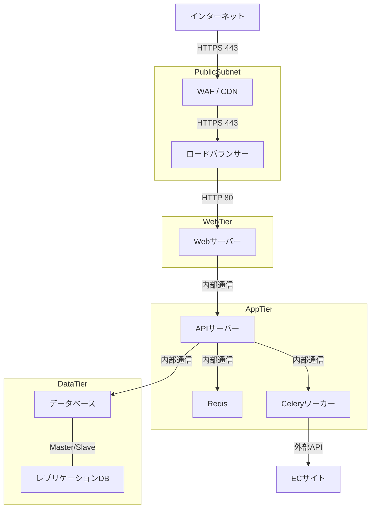

# セキュリティ詳細設計書

## 1. 概要

本書では、PriceAlert システムのセキュリティに関する詳細設計を記述します。ユーザーデータの保護、API 保護、認証・認可、インフラストラクチャセキュリティなど、システム全体のセキュリティ対策について説明します。

## 2. 認証・認可

### 2.1 認証方式

#### 2.1.1 JWT トークン認証

JSON ウェブトークン（JWT）を使用した認証システムを実装します：

```python
import jwt
from datetime import datetime, timedelta
from django.conf import settings

def generate_jwt_token(user_id, is_refresh=False):
    """
    JWTトークンを生成する
    """
    # 現在時刻
    now = datetime.utcnow()

    # ペイロード作成
    payload = {
        'user_id': user_id,
        'iat': now,
        'token_type': 'refresh' if is_refresh else 'access',
    }

    # 有効期限設定
    if is_refresh:
        payload['exp'] = now + timedelta(days=14)  # リフレッシュトークン：14日間
    else:
        payload['exp'] = now + timedelta(hours=2)  # アクセストークン：2時間

    # トークン署名・生成
    token = jwt.encode(
        payload,
        settings.JWT_SECRET_KEY,
        algorithm='HS256'
    )

    return token

def verify_jwt_token(token):
    """
    JWTトークンを検証する
    """
    try:
        # トークンデコード・検証
        payload = jwt.decode(
            token,
            settings.JWT_SECRET_KEY,
            algorithms=['HS256']
        )

        return payload

    except jwt.ExpiredSignatureError:
        # トークン有効期限切れ
        raise Exception('Token has expired')

    except jwt.InvalidTokenError:
        # 不正なトークン
        raise Exception('Invalid token')
```

#### 2.1.2 外部認証プロバイダ連携

Google 認証や Twitter 認証など、外部認証プロバイダとの連携を実装します：

```python
def login_with_google(token):
    """
    Googleアカウントでログイン
    """
    try:
        # Googleトークン検証
        user_info = verify_google_token(token)

        # メール検証済みかチェック
        if not user_info.get('email_verified'):
            raise Exception('Email not verified with Google')

        # ユーザー検索またはアカウント作成
        user = get_or_create_user(
            email=user_info['email'],
            name=user_info.get('name', ''),
            auth_provider='google'
        )

        # JWTトークン生成
        access_token = generate_jwt_token(user.id)
        refresh_token = generate_jwt_token(user.id, is_refresh=True)

        return {
            'user': user,
            'access_token': access_token,
            'refresh_token': refresh_token
        }

    except Exception as e:
        raise Exception(f'Google authentication failed: {str(e)}')
```

### 2.2 認可システム

#### 2.2.1 ロールベースアクセス制御（RBAC）

```python
from enum import Enum

class UserRole(Enum):
    USER = 'user'
    ADMIN = 'admin'

class Permission(Enum):
    VIEW_OWN_PRODUCTS = 'view_own_products'
    EDIT_OWN_PRODUCTS = 'edit_own_products'
    VIEW_ALL_PRODUCTS = 'view_all_products'
    MANAGE_USERS = 'manage_users'
    MANAGE_SYSTEM = 'manage_system'

# ロールごとの権限マッピング
ROLE_PERMISSIONS = {
    UserRole.USER: [
        Permission.VIEW_OWN_PRODUCTS,
        Permission.EDIT_OWN_PRODUCTS,
    ],
    UserRole.ADMIN: [
        Permission.VIEW_OWN_PRODUCTS,
        Permission.EDIT_OWN_PRODUCTS,
        Permission.VIEW_ALL_PRODUCTS,
        Permission.MANAGE_USERS,
        Permission.MANAGE_SYSTEM,
    ]
}

def has_permission(user, permission):
    """
    ユーザーが指定した権限を持っているか確認
    """
    role = UserRole(user.role)
    return permission in ROLE_PERMISSIONS.get(role, [])
```

#### 2.2.2 API 認可ミドルウェア

```python
from rest_framework.permissions import BasePermission

class HasProductAccess(BasePermission):
    """
    製品リソースへのアクセス権を確認するDRFパーミッション
    """
    def has_object_permission(self, request, view, obj):
        # 現在のユーザー
        user = request.user

        # 管理者は全アクセス権を持つ
        if user.role == 'admin':
            return True

        # ユーザー自身の製品かチェック
        if hasattr(obj, 'user_id'):
            return obj.user_id == user.id

        # UserProduct中間テーブル経由でチェック
        if hasattr(obj, 'id'):
            user_product = UserProduct.objects.filter(
                user_id=user.id,
                product_id=obj.id
            ).exists()
            return user_product

        return False
```

## 3. データ保護

### 3.1 暗号化

#### 3.1.1 データベース暗号化

アプリケーションレベルでのデータ暗号化：

```python
from cryptography.fernet import Fernet

class EncryptionService:
    def __init__(self, key=None):
        self.key = key or settings.ENCRYPTION_KEY
        self.cipher = Fernet(self.key)

    def encrypt(self, data):
        """
        データを暗号化
        """
        if isinstance(data, str):
            data = data.encode()
        return self.cipher.encrypt(data).decode()

    def decrypt(self, encrypted_data):
        """
        暗号化されたデータを復号
        """
        if isinstance(encrypted_data, str):
            encrypted_data = encrypted_data.encode()
        return self.cipher.decrypt(encrypted_data).decode()

# SQLAlchemyモデルでの使用例
class APIToken(Base):
    __tablename__ = 'api_tokens'

    id = Column(Integer, primary_key=True)
    user_id = Column(Integer, ForeignKey('users.id'), nullable=False)
    token_encrypted = Column(String(500), nullable=False)
    expires_at = Column(DateTime, nullable=False)
    created_at = Column(DateTime, default=datetime.utcnow)

    user = relationship("User", back_populates="api_tokens")

    # プロパティを使用して自動的に暗号化/復号
    @property
    def token(self):
        if self.token_encrypted:
            encryption_service = EncryptionService()
            return encryption_service.decrypt(self.token_encrypted)
        return None

    @token.setter
    def token(self, token_value):
        if token_value:
            encryption_service = EncryptionService()
            self.token_encrypted = encryption_service.encrypt(token_value)
```

#### 3.1.2 転送中のデータ暗号化

すべてのデータ転送に HTTPS を使用します：

```python
# settings.py
SECURE_SSL_REDIRECT = True  # HTTPリクエストをHTTPSにリダイレクト
SECURE_PROXY_SSL_HEADER = ('HTTP_X_FORWARDED_PROTO', 'https')
SESSION_COOKIE_SECURE = True  # セッションクッキーをHTTPSでのみ送信
CSRF_COOKIE_SECURE = True  # CSRFクッキーをHTTPSでのみ送信
```

### 3.2 パスワード管理

#### 3.2.1 安全なパスワードハッシュ

```python
import bcrypt

def hash_password(password):
    """
    パスワードをハッシュ化
    """
    # ソルト生成とハッシュ化
    password_bytes = password.encode('utf-8')
    salt = bcrypt.gensalt()
    password_hash = bcrypt.hashpw(password_bytes, salt)

    return password_hash.decode('utf-8')

def verify_password(password, password_hash):
    """
    パスワードとハッシュを検証
    """
    password_bytes = password.encode('utf-8')
    hash_bytes = password_hash.encode('utf-8')

    return bcrypt.checkpw(password_bytes, hash_bytes)
```

#### 3.2.2 パスワードポリシー

```python
import re

def validate_password(password):
    """
    パスワード強度の検証
    """
    errors = []

    # 長さチェック
    if len(password) < 8:
        errors.append("パスワードは8文字以上である必要があります")

    # 大文字を含むか
    if not re.search(r'[A-Z]', password):
        errors.append("パスワードには大文字を含める必要があります")

    # 小文字を含むか
    if not re.search(r'[a-z]', password):
        errors.append("パスワードには小文字を含める必要があります")

    # 数字を含むか
    if not re.search(r'\d', password):
        errors.append("パスワードには数字を含める必要があります")

    # 特殊文字を含むか
    if not re.search(r'[!@#$%^&*(),.?":{}|<>]', password):
        errors.append("パスワードには特殊文字を含める必要があります")

    return errors
```

## 4. API 保護

### 4.1 レート制限

```python
from django.core.cache import cache
from rest_framework.throttling import BaseThrottle
from rest_framework.exceptions import Throttled

class CustomRateThrottle(BaseThrottle):
    """
    カスタムレート制限実装
    """
    scope = 'user'  # デフォルトスコープ

    # スコープごとのレート制限定義
    THROTTLE_RATES = {
        'user': '60/min',       # 認証済みユーザー
        'anon': '20/min',       # 匿名ユーザー
        'sensitive': '3/min',   # センシティブな操作
        'login': '5/min',       # ログイン試行
    }

    def __init__(self):
        self.rate = self.get_rate()
        self.num_requests, self.duration = self.parse_rate(self.rate)

    def get_rate(self):
        """
        現在のスコープのレート制限を取得
        """
        return self.THROTTLE_RATES.get(self.scope, '60/min')

    def get_cache_key(self, request, view):
        """
        キャッシュキーを生成
        """
        if request.user.is_authenticated:
            ident = request.user.id
        else:
            ident = self.get_ident(request)

        return f'throttle_{self.scope}_{ident}'

    def allow_request(self, request, view):
        """
        リクエストを許可するか判断
        """
        # キャッシュキー取得
        key = self.get_cache_key(request, view)

        # 現在のカウント取得
        count = cache.get(key, 0)

        # 制限を超えていればFalse
        if count >= self.num_requests:
            return False

        # カウント増加
        cache.set(key, count + 1, self.duration)

        return True

    def wait(self):
        """
        次のリクエスト可能までの秒数
        """
        return self.duration
```

### 4.2 CSRF 保護

```python
# settings.py
CSRF_TRUSTED_ORIGINS = ['https://pricealert.example.com']
CSRF_USE_SESSIONS = True
CSRF_COOKIE_HTTPONLY = True
CSRF_COOKIE_SAMESITE = 'Lax'
```

### 4.3 ヘッダーセキュリティ

```python
# settings.py
SECURE_HSTS_SECONDS = 31536000  # 1年間
SECURE_HSTS_INCLUDE_SUBDOMAINS = True
SECURE_HSTS_PRELOAD = True
SECURE_CONTENT_TYPE_NOSNIFF = True
SECURE_BROWSER_XSS_FILTER = True
X_FRAME_OPTIONS = 'DENY'
```

## 5. インフラストラクチャセキュリティ

### 5.1 ネットワークセキュリティ



### 5.2 Docker 環境のセキュリティ

```yaml
# docker-compose.yml のセキュリティ設定例
version: "3.8"

services:
  web:
    image: price_alert_web:latest
    restart: unless-stopped
    security_opt:
      - no-new-privileges:true
    cap_drop:
      - ALL
    read_only: true
    tmpfs:
      - /tmp
    volumes:
      - /var/run/docker.sock:/var/run/docker.sock:ro
    environment:
      - DATABASE_URL=postgresql://user:pass@db:5432/price_alert
      - REDIS_URL=redis://redis:6379/0
      - SECRET_KEY=${SECRET_KEY}
      - ALLOWED_HOSTS=localhost,pricealert.example.com
    depends_on:
      - db
      - redis
    networks:
      - app_net

  db:
    image: postgres:14-alpine
    restart: unless-stopped
    volumes:
      - postgres_data:/var/lib/postgresql/data
    environment:
      - POSTGRES_USER=${DB_USER}
      - POSTGRES_PASSWORD=${DB_PASS}
      - POSTGRES_DB=price_alert
    networks:
      - db_net

  redis:
    image: redis:alpine
    restart: unless-stopped
    command: redis-server --requirepass ${REDIS_PASS}
    volumes:
      - redis_data:/data
    networks:
      - app_net

networks:
  app_net:
    driver: bridge
  db_net:
    driver: bridge
    internal: true # 内部ネットワークのみ

volumes:
  postgres_data:
  redis_data:
```

## 6. セキュリティ監視と対応

### 6.1 ログ収集と監視

```python
import logging
import json
from datetime import datetime

class SecurityLogger:
    def __init__(self):
        self.logger = logging.getLogger('security')

    def log_security_event(self, event_type, user_id=None, ip_address=None, details=None, severity='INFO'):
        """
        セキュリティイベントをログに記録
        """
        log_data = {
            'timestamp': datetime.utcnow().isoformat(),
            'event_type': event_type,
            'user_id': user_id,
            'ip_address': ip_address,
            'details': details,
            'severity': severity
        }

        # 重要度に応じたログレベル
        if severity == 'INFO':
            self.logger.info(json.dumps(log_data))
        elif severity == 'WARNING':
            self.logger.warning(json.dumps(log_data))
        elif severity == 'ERROR':
            self.logger.error(json.dumps(log_data))
        elif severity == 'CRITICAL':
            self.logger.critical(json.dumps(log_data))
```

### 6.2 セキュリティインシデント対応

#### 6.2.1 不正アクセス検出

```python
class LoginAttemptTracker:
    def __init__(self, redis_client):
        self.redis = redis_client
        self.max_attempts = 5
        self.block_duration = 30 * 60  # 30分（秒単位）

    def track_login_attempt(self, email, ip_address, success):
        """
        ログイン試行を追跡し、不正アクセスの可能性を検出
        """
        # キー生成
        email_key = f"login:email:{email}"
        ip_key = f"login:ip:{ip_address}"

        # 現在の時刻（UNIX秒）
        now = int(datetime.utcnow().timestamp())

        if success:
            # ログイン成功時はカウンタをリセット
            self.redis.delete(email_key)
            return

        # ログイン失敗時
        # メールアドレスに対する失敗カウント
        email_count = self.redis.incr(email_key)
        self.redis.expire(email_key, self.block_duration)

        # IPアドレスに対する失敗カウント
        ip_count = self.redis.incr(ip_key)
        self.redis.expire(ip_key, self.block_duration)

        # アカウントロック状態確認
        is_blocked = email_count > self.max_attempts

        # ロック状態ならセキュリティイベントをログ
        if is_blocked:
            security_logger = SecurityLogger()
            security_logger.log_security_event(
                event_type='account_locked',
                user_id=None,
                ip_address=ip_address,
                details={
                    'email': email,
                    'failed_attempts': email_count,
                    'duration': self.block_duration
                },
                severity='WARNING'
            )

        return is_blocked
```

## 7. セキュリティテスト計画

### 7.1 脆弱性スキャン

定期的な脆弱性スキャンを行い、セキュリティ脆弱性を早期発見します。以下のツールを使用します：

- OWASP ZAP - ウェブアプリケーションの脆弱性スキャン
- Bandit - Python コードの静的セキュリティ解析
- npm audit - JavaScript パッケージの脆弱性チェック
- Docker Bench Security - Docker コンテナのセキュリティベストプラクティス検証

### 7.2 ペネトレーションテスト

年に一度、以下の領域に焦点を当てたペネトレーションテストを実施します：

1. 認証・認可システムの堅牢性
2. 入力バリデーションと XSS および SQL インジェクション対策
3. セッション管理の安全性
4. API エンドポイントの保護
5. 暗号化実装の適切さ
