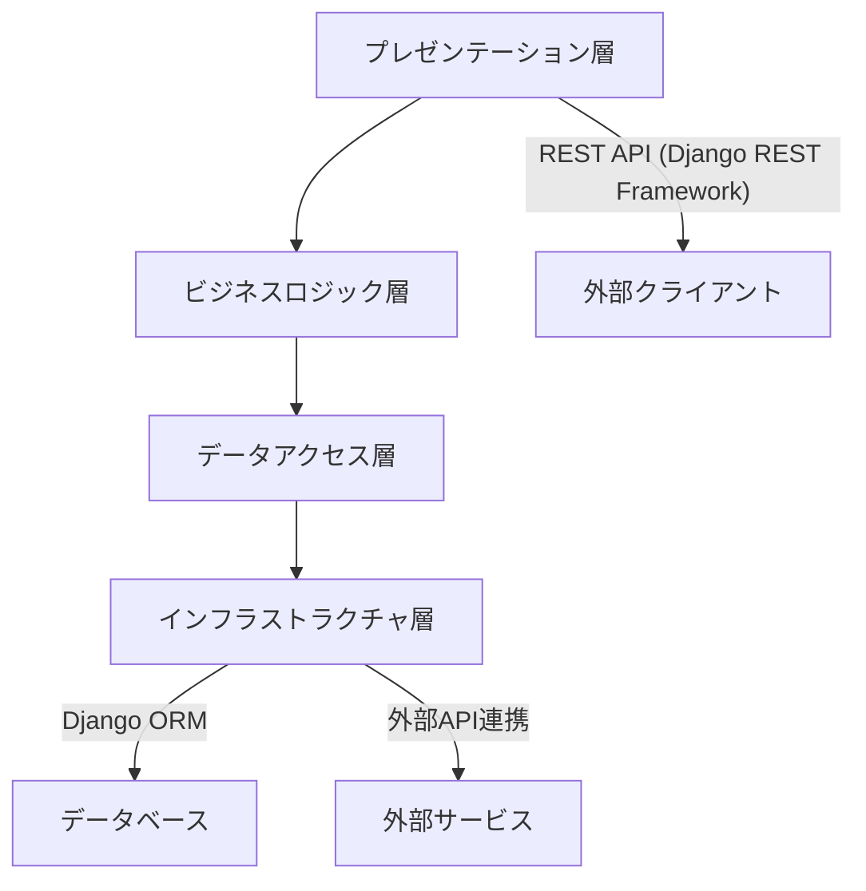
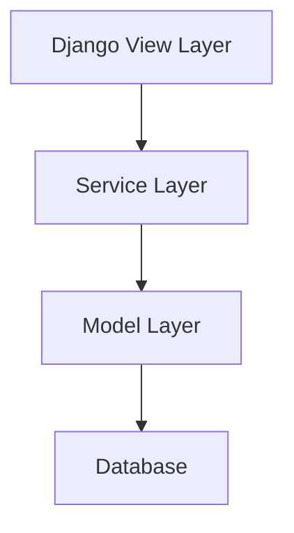

# バックエンド詳細設計書

## 1. 概要

本書では、PriceAlert システムのバックエンド実装に関する詳細設計を記述します。Django フレームワークと Django ORM をベースとし、MVT（Model-View-Template）アーキテクチャに沿った設計を行います。

## 2. アーキテクチャ

### 2.1 レイヤー構成

バックエンドは以下の 4 つの主要レイヤーから構成されます：



| レイヤー               | 責務                                 | 主要コンポーネント                 |
| ---------------------- | ------------------------------------ | ---------------------------------- |
| プレゼンテーション層   | API、リクエスト/レスポンス処理       | ViewSets, Serializers, Permissions |
| ビジネスロジック層     | ビジネスルール、ドメインロジック実装 | Services, Tasks                    |
| データアクセス層       | データアクセスとデータ操作           | Models, Managers, QuerySets        |
| インフラストラクチャ層 | 外部サービス連携、データ永続化       | Database, External APIs            |

### 2.2 Django MVT アーキテクチャ

Django の標準的な MVT アーキテクチャを採用します：



## 3. Django モデル定義

### 3.1 モデル定義の基本構造

```python
from django.db import models
from django.contrib.auth.models import AbstractBaseUser, PermissionsMixin
from django.utils import timezone

class User(AbstractBaseUser, PermissionsMixin):
    email = models.EmailField(max_length=255, unique=True)
    username = models.CharField(max_length=100)
    is_active = models.BooleanField(default=True)
    is_staff = models.BooleanField(default=False)
    created_at = models.DateTimeField(auto_now_add=True)
    updated_at = models.DateTimeField(auto_now=True)
    last_login = models.DateTimeField(blank=True, null=True)

    USERNAME_FIELD = 'email'
    REQUIRED_FIELDS = ['username']

    objects = UserManager()

    def __str__(self):
        return self.email
```

### 3.2 主要モデル一覧

以下に Django モデルとして実装する主要モデルを示します：

1. **User** - ユーザー情報
2. **UserSettings** - ユーザー設定
3. **Product** - 商品情報
4. **ECSite** - EC サイト情報
5. **ProductOnECSite** - 商品と EC サイトの紐付け
6. **UserProduct** - ユーザーと商品の紐付け
7. **PriceHistory** - 価格履歴
8. **Alert** - アラート設定
9. **Notification** - 通知
10. **APIToken** - API トークン
11. **ProductMapping** - 商品マッピング

## 4. データアクセス層

### 4.1 カスタムマネージャー

データアクセスは Django のモデルマネージャーを拡張して実装します：

```python
from django.db import models
from django.db.models import Q

class UserProductManager(models.Manager):
    def get_by_user_id(self, user_id):
        return self.filter(user_id=user_id)

    def get_by_user_and_product(self, user_id, product_id):
        return self.filter(user_id=user_id, product_id=product_id).first()

    def get_with_price_alerts(self, user_id=None):
        queryset = self.filter(notification_enabled=True)
        if user_id:
            queryset = queryset.filter(user_id=user_id)
        return queryset.select_related('product')
```

### 4.2 トランザクション管理

Django の標準的なトランザクション管理を使用します：

```python
from django.db import transaction

# トランザクションのコンテキストマネージャを使用した例
def create_product_with_mapping(self, product_data, mapping_data):
    with transaction.atomic():
        product = Product.objects.create(**product_data)
        for mapping in mapping_data:
            ProductMapping.objects.create(product=product, **mapping)
        return product

# デコレータを使用した例
@transaction.atomic
def update_price_and_notify(self, product_id, new_price):
    product = Product.objects.select_for_update().get(id=product_id)
    old_price = product.current_price
    product.current_price = new_price
    product.save()

    # 価格変動の通知条件確認
    user_products = UserProduct.objects.filter(
        product=product,
        notification_enabled=True,
        price_threshold__gte=new_price
    )

    for user_product in user_products:
        Notification.objects.create(
            user=user_product.user,
            product=product,
            old_price=old_price,
            new_price=new_price,
            notification_type='price_drop'
        )
```

## 5. ビジネスロジック層

### 5.1 サービスクラス

ビジネスロジックはサービスクラスに実装します：

```python
class ProductService:
    def register_product_from_url(self, user_id, url):
        # URLからECサイト識別
        ec_site = self._identify_ec_site(url)

        # ECサイトコネクター取得
        connector = self._get_connector(ec_site.code)

        # 商品情報取得
        product_info = connector.fetch_product_info(url)

        # 既存商品確認またはDB登録
        try:
            product = Product.objects.get(external_id=product_info['code'])
        except Product.DoesNotExist:
            product = Product.objects.create(
                name=product_info['name'],
                description=product_info['description'],
                image_url=product_info['image_url'],
                manufacturer=product_info['manufacturer'],
                model_number=product_info['model_number'],
                jan_code=product_info['jan_code'],
                external_id=product_info['code']
            )

        # ユーザーと商品の紐付け
        user_product, created = UserProduct.objects.get_or_create(
            user_id=user_id,
            product=product,
            defaults={'notification_enabled': True}
        )

        # 商品とECサイトの紐付け
        product_on_ec_site, created = ProductOnECSite.objects.get_or_create(
            product=product,
            ec_site=ec_site,
            defaults={
                'product_url': url,
                'current_price': product_info['price'],
                'current_points': product_info['points'],
                'effective_price': product_info['price'] - product_info['points']
            }
        )

        return user_product
```

### 5.2 Celery タスク

非同期処理は Celery タスクとして実装します：

```python
@app.task(bind=True, max_retries=3, default_retry_delay=300)
def collect_prices(self):
    try:
        # 更新対象商品取得
        products_on_ec_sites = ProductOnECSite.objects.all()

        for product_on_ec_site in products_on_ec_sites:
            # ECサイトコネクター取得
            try:
                ec_site = product_on_ec_site.ec_site
                connector = get_connector(ec_site.code)

                # 価格情報取得
                price_info = connector.fetch_price(product_on_ec_site.product_url)

                # 価格履歴登録
                PriceHistory.objects.create(
                    product_on_ec_site=product_on_ec_site,
                    price=price_info['price'],
                    points=price_info['points'],
                    effective_price=price_info['price'] - price_info['points'],
                    captured_at=timezone.now()
                )

                # 最新価格更新
                product_on_ec_site.current_price = price_info['price']
                product_on_ec_site.current_points = price_info['points']
                product_on_ec_site.effective_price = price_info['price'] - price_info['points']
                product_on_ec_site.last_updated = timezone.now()
                product_on_ec_site.save()

            except Exception as e:
                # 個別の商品でエラーが発生しても他の商品は処理を継続
                logger.error(f"Error collecting price for product {product_on_ec_site.id}: {str(e)}")
                continue

    except Exception as e:
        logger.error(f"Error in collect_prices task: {str(e)}")
        raise self.retry(exc=e)
```

## 6. プレゼンテーション層

### 6.1 Django REST Framework ビュー

Django REST Framework のビューは以下のように実装します：

```python
from rest_framework import viewsets, status
from rest_framework.response import Response
from rest_framework.permissions import IsAuthenticated
from rest_framework.decorators import action

class ProductViewSet(viewsets.ModelViewSet):
    serializer_class = ProductSerializer
    permission_classes = [IsAuthenticated]

    def get_queryset(self):
        # ユーザーに紐づく商品のみ返す
        return Product.objects.filter(
            userproduct__user=self.request.user
        ).distinct()

    @action(detail=False, methods=['post'])
    def register_from_url(self, request):
        url = request.data.get('url')
        if not url:
            return Response(
                {'error': 'URLが指定されていません。'},
                status=status.HTTP_400_BAD_REQUEST
            )

        try:
            service = ProductService()
            user_product = service.register_product_from_url(
                user_id=request.user.id,
                url=url
            )

            serializer = UserProductSerializer(user_product)
            return Response(serializer.data, status=status.HTTP_201_CREATED)

        except InvalidURLException:
            return Response(
                {'error': 'URLの形式が正しくありません。'},
                status=status.HTTP_400_BAD_REQUEST
            )
        except ProductNotFoundException:
            return Response(
                {'error': '商品情報が取得できませんでした。'},
                status=status.HTTP_404_NOT_FOUND
            )
```

### 6.2 シリアライザー

データの変換とバリデーションは Django REST Framework のシリアライザーを使用します：

```python
from rest_framework import serializers

class ProductSerializer(serializers.ModelSerializer):
    class Meta:
        model = Product
        fields = ['id', 'name', 'description', 'image_url', 'manufacturer',
                 'model_number', 'jan_code', 'created_at', 'updated_at']

class UserProductSerializer(serializers.ModelSerializer):
    product = ProductSerializer(read_only=True)

    class Meta:
        model = UserProduct
        fields = ['id', 'product', 'price_threshold', 'threshold_type',
                 'threshold_percentage', 'notification_enabled']
        read_only_fields = ['id', 'product']
```

## 7. マイグレーション管理

### 7.1 Django マイグレーション

Django の標準的なマイグレーション機能を使用してスキーマ管理を行います：

```bash
# マイグレーションファイルの作成
python manage.py makemigrations

# マイグレーションの適用
python manage.py migrate

# 特定アプリのマイグレーション適用
python manage.py migrate products

# マイグレーション計画の確認
python manage.py showmigrations
```

### 7.2 データマイグレーション

複雑なデータ移行は Django のデータマイグレーションを使用します：

```python
# データマイグレーションの作成
# python manage.py makemigrations products --empty -n migrate_product_data

# migrations/0002_migrate_product_data.py
from django.db import migrations

def update_product_effective_prices(apps, schema_editor):
    # 過去のモデル状態を取得
    Product = apps.get_model('products', 'Product')
    ProductOnECSite = apps.get_model('products', 'ProductOnECSite')

    # 全商品の実質価格を更新
    for product_on_ec_site in ProductOnECSite.objects.all():
        product_on_ec_site.effective_price = product_on_ec_site.current_price - product_on_ec_site.current_points
        product_on_ec_site.save()

def reverse_func(apps, schema_editor):
    # 特に元に戻す処理は不要
    pass

class Migration(migrations.Migration):
    dependencies = [
        ('products', '0001_initial'),
    ]

    operations = [
        migrations.RunPython(update_product_effective_prices, reverse_func),
    ]
```

## 8. パフォーマンス最適化

### 8.1 クエリ最適化

Django ORM のクエリ最適化テクニックを適用します：

```python
# N+1問題を回避するための最適化例
def get_user_products_with_details(user_id):
    # select_related でリレーション先を一度に取得
    return UserProduct.objects.filter(user_id=user_id).select_related(
        'product',
        'product__brand'
    ).prefetch_related(
        # prefetch_related で 多対多・1対多 のリレーションを一度に取得
        'product__product_on_ec_sites__ec_site'
    )

# 集計クエリの最適化
def get_price_statistics():
    from django.db.models import Avg, Min, Max, Count

    return Product.objects.annotate(
        avg_price=Avg('product_on_ec_sites__current_price'),
        min_price=Min('product_on_ec_sites__current_price'),
        max_price=Max('product_on_ec_sites__current_price'),
        site_count=Count('product_on_ec_sites')
    ).filter(site_count__gt=0)
```

### 8.2 キャッシュ戦略

Django のキャッシュ機能を活用したデータアクセス最適化：

```python
from django.core.cache import cache
from django.views.decorators.cache import cache_page
from django.utils.decorators import method_decorator

# ビューのキャッシュ
@method_decorator(cache_page(60 * 15), name='dispatch')  # 15分キャッシュ
class ProductListView(generics.ListAPIView):
    serializer_class = ProductSerializer
    queryset = Product.objects.all()

# 手動キャッシュの使用例
def get_product_by_id(product_id):
    cache_key = f'product:{product_id}'
    product = cache.get(cache_key)
    if not product:
        try:
            product = Product.objects.get(id=product_id)
            cache.set(cache_key, product, timeout=3600)  # 1時間キャッシュ
        except Product.DoesNotExist:
            return None
    return product
```

## 9. エラー処理

### 9.1 例外ハンドリング

アプリケーション固有の例外を定義します：

```python
class PriceAlertException(Exception):
    """アプリケーション基底例外"""
    pass

class ProductNotFoundException(PriceAlertException):
    """商品が見つからない場合の例外"""
    pass

class InvalidURLException(PriceAlertException):
    """無効なURLの場合の例外"""
    pass

class ECServiceUnavailableException(PriceAlertException):
    """ECサイトサービスが利用できない場合の例外"""
    pass
```

### 9.2 グローバル例外ハンドラー

Django REST Framework のグローバル例外ハンドラー：

```python
from rest_framework.views import exception_handler
from rest_framework.response import Response
from rest_framework import status

def custom_exception_handler(exc, context):
    # 標準のハンドラーを呼び出す
    response = exception_handler(exc, context)

    # レスポンスがない場合は、カスタム例外のハンドリング
    if response is None:
        if isinstance(exc, ProductNotFoundException):
            response = Response(
                {'error': str(exc) or '商品が見つかりません。'},
                status=status.HTTP_404_NOT_FOUND
            )
        elif isinstance(exc, InvalidURLException):
            response = Response(
                {'error': str(exc) or 'URLの形式が正しくありません。'},
                status=status.HTTP_400_BAD_REQUEST
            )
        elif isinstance(exc, ECServiceUnavailableException):
            response = Response(
                {'error': str(exc) or 'ECサイトサービスが一時的に利用できません。'},
                status=status.HTTP_503_SERVICE_UNAVAILABLE
            )

    return response
```

### 9.4 認証・認可モジュール

#### 9.4.1 認証処理フロー

1. **ログイン処理**

   - `POST /api/v1/auth/login/`
   - メールアドレスとパスワードの検証
   - アクセストークン・リフレッシュトークンの生成と返却

2. **トークン検証**

   - リクエストヘッダからトークン取得
   - トークンの署名検証
   - ペイロードからユーザー情報取得

3. **トークン更新**

   - `POST /api/v1/auth/token/refresh/`
   - リフレッシュトークンの検証
   - 新しいアクセストークンの生成と返却

4. **パスワードリセット**

   - **リセットリクエスト処理**

     - `POST /api/v1/auth/password-reset/request/`
     - ユーザーのメールアドレス検証
     - ユーザーが存在する場合、一意のリセットトークンを生成（UUID4）
     - トークンとユーザーの関連付けをデータベースに保存（`password_reset_tokens`テーブル）
     - 有効期限（1 時間）とともに保存
     - リセットリンク（`https://frontend-url/reset-password/{token}`）を含むメールを送信
     - セキュリティ対策として、リクエスト送信結果はユーザーの存在/不存在に関わらず同一メッセージを返す

   - **パスワードリセット実行処理**
     - `POST /api/v1/auth/password-reset/confirm/`
     - トークンの存在検証
     - トークンの有効期限検証
     - トークンの使用済み状態検証
     - 新しいパスワードの強度検証
     - パスワードのハッシュ化と更新
     - トークンを使用済みに設定
     - ユーザーに確認メールを送信
     - 成功メッセージの返却

#### 9.4.2 認証関連データモデル

1. **User モデル**

   ```python
   class User(AbstractBaseUser, PermissionsMixin):
       email = models.EmailField(max_length=255, unique=True)
       username = models.CharField(max_length=255, blank=True, null=True)
       is_active = models.BooleanField(default=True)
       is_staff = models.BooleanField(default=False)
       date_joined = models.DateTimeField(auto_now_add=True)

       # その他のフィールド...
   ```

2. **PasswordResetToken モデル**

   ```python
   class PasswordResetToken(models.Model):
       user = models.ForeignKey(User, on_delete=models.CASCADE, related_name='password_reset_tokens')
       token = models.CharField(max_length=255, unique=True)
       is_used = models.BooleanField(default=False)
       expires_at = models.DateTimeField()
       created_at = models.DateTimeField(auto_now_add=True)
       updated_at = models.DateTimeField(auto_now=True)

       def is_valid(self):
           """トークンが有効かどうかを検証"""
           return not self.is_used and self.expires_at > timezone.now()
   ```

#### 9.4.3 パスワードリセットメール送信機能

1. **メール送信処理**

   ```python
   def send_password_reset_email(user, reset_token):
       """パスワードリセットメールを送信"""
       frontend_url = settings.FRONTEND_URL
       reset_url = f"{frontend_url}/reset-password/{reset_token}"

       subject = "【PriceAlert】パスワードリセットのご案内"
       html_message = render_to_string(
           'emails/password_reset.html',
           {
               'user': user,
               'reset_url': reset_url,
               'valid_hours': 24,
           }
       )
       plain_message = strip_tags(html_message)

       send_mail(
           subject,
           plain_message,
           settings.DEFAULT_FROM_EMAIL,
           [user.email],
           html_message=html_message,
           fail_silently=False,
       )
   ```

2. **メールテンプレート管理**
   - `templates/emails/password_reset.html` - HTML 形式のテンプレート
   - `templates/emails/password_reset_confirmation.html` - 確認メール用テンプレート

## 10. テスト方針

### 10.1 単体テスト

Django のテストフレームワークを使用したテスト例：

```python
from django.test import TestCase
from django.contrib.auth import get_user_model
from products.models import Product, UserProduct

User = get_user_model()

class ProductModelTest(TestCase):
    def setUp(self):
        # テストユーザーを作成
        self.user = User.objects.create_user(
            email='test@example.com',
            username='testuser',
            password='password123'
        )

        # テスト商品を作成
        self.product = Product.objects.create(
            name='テスト商品',
            description='テスト用の商品です',
            image_url='https://example.com/image.jpg',
            manufacturer='テストメーカー',
            model_number='TEST-01',
            jan_code='1234567890123'
        )

        # ユーザーと商品を関連付け
        self.user_product = UserProduct.objects.create(
            user=self.user,
            product=self.product,
            price_threshold=10000,
            notification_enabled=True
        )

    def test_user_product_relation(self):
        # ユーザーに紐づく商品の確認
        user_products = UserProduct.objects.filter(user=self.user)
        self.assertEqual(user_products.count(), 1)
        self.assertEqual(user_products.first().product, self.product)

    def test_price_threshold_check(self):
        # 価格閾値チェック機能のテスト
        from products.services import check_price_threshold

        # 閾値以下の場合
        should_notify = check_price_threshold(self.user_product, 9000)
        self.assertTrue(should_notify)

        # 閾値より高い場合
        should_notify = check_price_threshold(self.user_product, 11000)
        self.assertFalse(should_notify)
```
